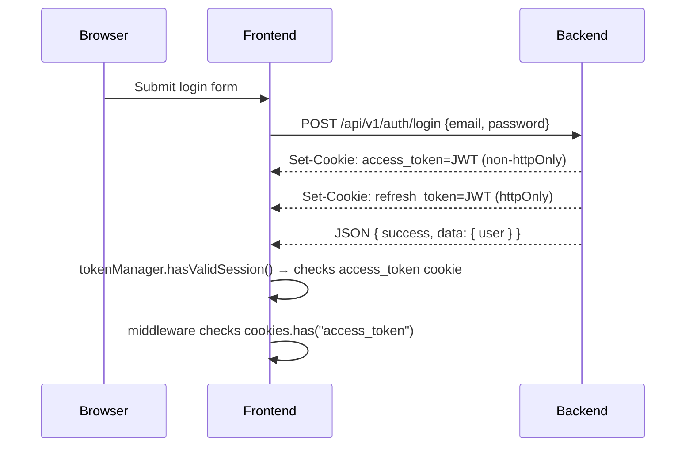
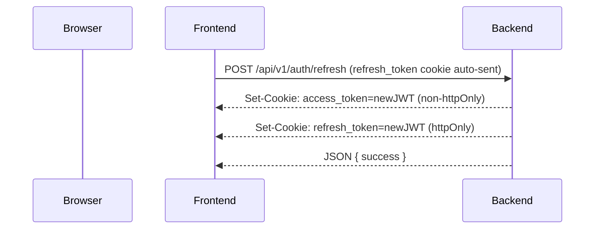
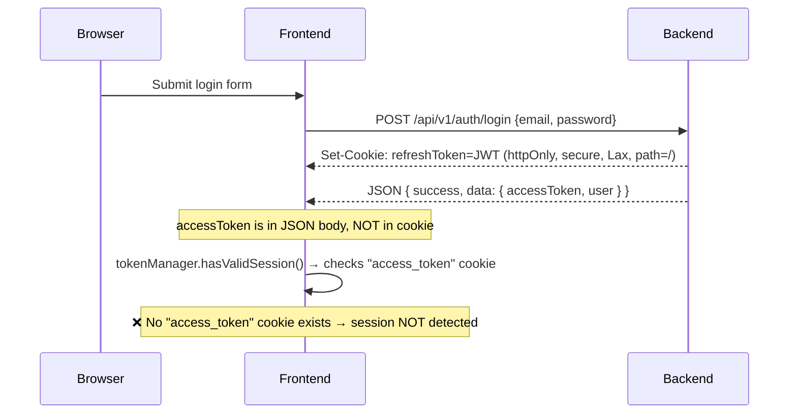
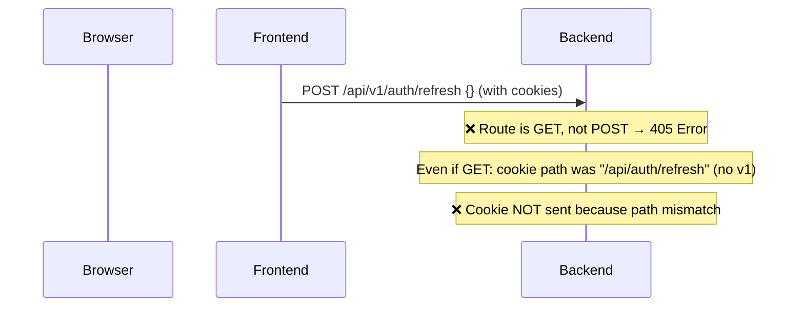

# 🔍 Discovery D6: Cookie Flow Report

> **Generated**: 2026-02-25

---

## 1. Expected Cookie Flow (Per Frontend Design)

### Login Flow (Expected)


### Refresh Flow (Expected)


---

## 2. Actual Cookie Flow (Per Backend Code)

### Login Flow (Actual)


### Refresh Flow (Actual)


---

## 3. Cookie Configuration Comparison

### Access Token Cookie

| Aspect | Frontend Expects | Backend Provides |
|---|---|---|
| **Cookie Name** | `access_token` | NOT SET as cookie (sent in JSON body as `data.accessToken`) |
| **HttpOnly** | `false` (must be readable by JS for `tokenManager.hasValidSession()`) | N/A |
| **Where Used** | `middleware.js` L24, `token-manager.js` L33, `cookie-service.js` L52-54 | Login controller returns in JSON body |
| **Impact** | Session detection fails completely | ❌ BROKEN |

### Refresh Token Cookie

| Aspect | Frontend Expects | Backend Provides |
|---|---|---|
| **Cookie Name** | `refresh_token` | `refreshToken` (from .env REFRESH_TOKEN_COOKIE_NAME) |
| **HttpOnly** | `true` (documented in comments) | `true` ✅ |
| **Secure** | `false` in dev, `true` in prod | `true` always ❌ (won't work on http://localhost) |
| **SameSite** | `strict` (cookie-service.js) | `Lax` (backend cookie-service) |
| **Path** | `/` (expected) | `/` on login, BUT `/api/auth/refresh` on refresh ❌ |

### Login Controller Cookie Setting
```javascript
// backend login.controller.js L16-19
setCookie(res, REFRESH_TOKEN_COOKIE_NAME, result.data.refreshToken, {
  maxAge: process.env.REFRESH_TOKEN_COOKIE_MAX_AGE || 24 * 60 * 60 * 1000,
});
// Note: only maxAge is overridden. Other defaults apply:
// httpOnly: true, secure: true, sameSite: "Lax", path: "/"
```

### Refresh Controller Cookie Setting (after successful refresh)
```javascript
// backend refresh.controller.js L25-31
setCookie(res, REFRESH_TOKEN_COOKIE_NAME, result.data.newRefreshToken, {
  maxAge: ...,
  httpOnly: true,
  secure: process.env.NODE_ENV === "production",
  sameSite: "strict",
  path: "/api/auth/refresh",  // ❌ SCOPED PATH — cookie only sent to this specific route
});
```

---

## 4. Critical Cookie Issues

### Issue 1: No Access Token Cookie Set by Backend
**Severity**: 🔴 BLOCKER

The backend never sets an `access_token` cookie. It sends the accessToken in the JSON response body:
```json
{ "success": true, "data": { "accessToken": "jwt...", "user": {...} } }
```

The frontend expects to find an `access_token` cookie for session detection. Without it:
- `tokenManager.hasValidSession()` returns `false` always
- `middleware.js` considers user unauthenticated always
- All protected routes redirect to login

**Fix**: Either (a) backend sets a non-httpOnly `access_token` cookie, or (b) frontend extracts the token from JSON and stores it as a cookie client-side via `cookieService.set()`.

### Issue 2: Cookie Name Mismatch
**Severity**: 🔴 BLOCKER

| Frontend | Backend |
|---|---|
| `access_token` | `accessToken` (or not set at all) |
| `refresh_token` | `refreshToken` |

Even if backend set cookies, frontend would look for the wrong name.

### Issue 3: Refresh Cookie Path Scoping
**Severity**: 🔴 BLOCKER

After a successful refresh, the new refresh token cookie is set with `path: "/api/auth/refresh"`. This means:
1. The cookie is only included in requests to `/api/auth/refresh`
2. The actual route is `/api/v1/auth/refresh` (with `v1` prefix)
3. The path doesn't match → cookie is NEVER sent

### Issue 4: Secure Cookie in Development
**Severity**: 🟠 HIGH

Backend `AUTH_COOKIE_DEFAULTS` has `secure: true` unconditionally. The login controller doesn't override this. On `http://localhost`, secure cookies are rejected by browsers.

The refresh controller conditionally sets `secure: process.env.NODE_ENV === "production"` — but the login controller uses the `AUTH_COOKIE_DEFAULTS` which is always `true`.

### Issue 5: SameSite Inconsistency
**Severity**: 🟡 LOW (only matters if cross-origin)

- Backend default: `sameSite: "Lax"` (login cookie)
- Backend refresh: `sameSite: "strict"` (refresh cookie)
- Frontend: `sameSite: "strict"` (cookie-service.js)

If using the Next.js proxy (same-origin), this doesn't matter. If cross-origin direct, `strict` would block cookie delivery on cross-origin navigations.

---

## 5. Recommended Cookie Architecture

```
LOGIN SUCCESS:
  Backend sets:
    - Cookie "access_token" (non-httpOnly, path="/", secure=env-based, sameSite="Lax")
    - Cookie "refresh_token" (httpOnly, path="/", secure=env-based, sameSite="Lax")
  Response body: { success, data: { user } }

TOKEN REFRESH:
  Backend sets:
    - Cookie "access_token" (non-httpOnly, path="/", secure=env-based, sameSite="Lax")
    - Cookie "refresh_token" (httpOnly, path="/", secure=env-based, sameSite="Lax")
  Response body: { success, data: { user } }
```
