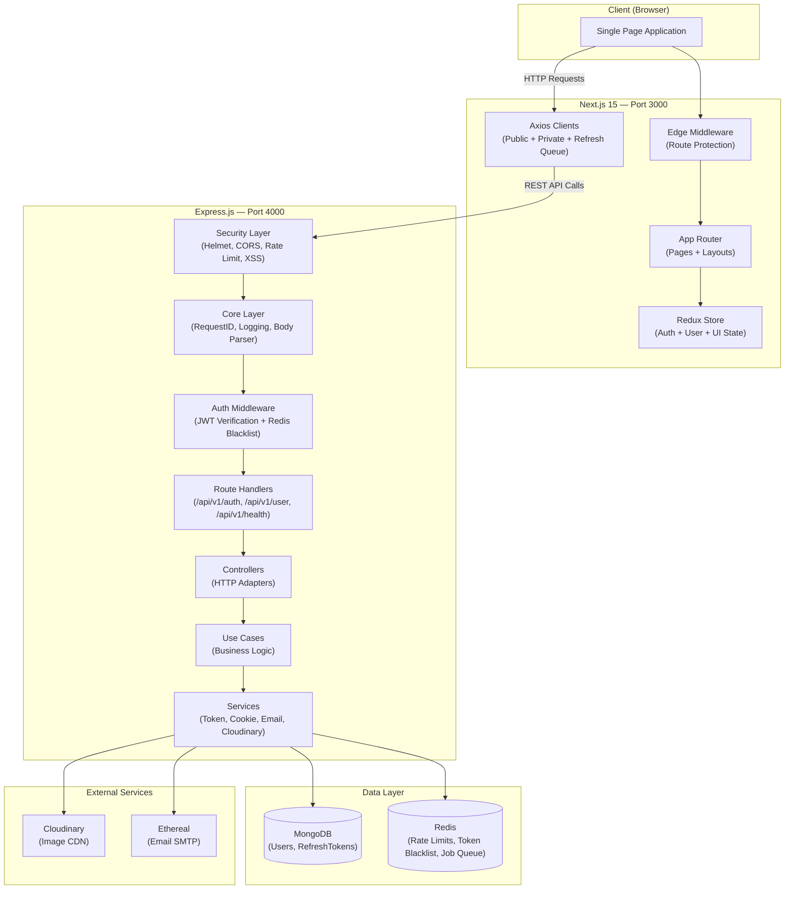
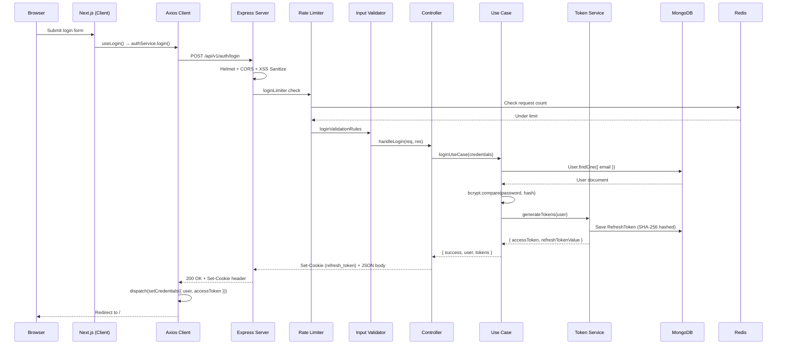

# System Overview — New Starter Kit

## 1. Project Identity

New Starter Kit is a full-stack starter kit with authentication, authorization (planned), and user management. It is built for rapid project bootstrapping.

| Layer | Technology | Version |
|-------|-----------|---------|
| Frontend Framework | Next.js (App Router) | 15 |
| UI Library | React | 18 |
| Styling | Tailwind CSS + shadcn/ui | — |
| State Management | Redux Toolkit + redux-persist | — |
| HTTP Client | Axios (interceptor-equipped) | — |
| Form Validation | Zod + react-hook-form | — |
| Backend Framework | Express.js | — |
| Runtime | Node.js | 24 |
| Database | MongoDB (Mongoose ODM) | — |
| Cache / Sessions | Redis (ioredis) | — |
| Job Queue | Bull (Redis-backed) | — |
| Auth | JWT (access) + HTTP-only cookie (refresh) | — |
| Email | Ethereal Email (Nodemailer SMTP) | — |
| File Storage | Cloudinary | — |
| Testing | Vitest + supertest + mongodb-memory-server | — |
| Internationalization | next-intl | — |
| Notifications | Sonner (via NotificationService facade) | — |

## 2. High-Level Architecture

The system follows a three-tier architecture. The Next.js SPA communicates with an Express REST API, which connects to MongoDB for persistence and Redis for caching, rate-limiting, and job queues. External services like Cloudinary and Ethereal Email are integrated for file storage and email delivery.

## 3. Request Lifecycle

Every API request passes through a deterministic middleware pipeline before reaching business logic. The following diagram shows a login request traversing the full stack.

## 4. Layer Separation

The system enforces strict layer boundaries to maintain architectural integrity. Each layer has defined responsibilities and may only communicate with adjacent layers. This prevents leaky abstractions and ensures consistent dependency flow from UI → business logic → infrastructure → data.

| Layer | Responsibility | May Call | Must NOT Call |
|-------|---------------|---------|---------------|
| Pages (Next.js) | Route rendering, layout | Hooks, Components | Redux, API, Navigation |
| Hooks | Business logic orchestration | Redux, API Services, Navigation | DOM, Direct fetch |
| Components | Presentation (props only) | Nothing | Redux, API, Hooks, Navigation |
| Axios Clients | HTTP transport + interceptors | Redux (token injection) | Use Cases, MongoDB |
| Controllers | HTTP adapter (req/res) | Use Cases | Models, Services directly |
| Use Cases | Business logic | Services, Models | req/res objects, Express |
| Services | Infrastructure integration | Models, External APIs, Redis | Controllers, Use Cases |
| Models | Data schema + persistence | MongoDB driver | Anything above |

**Note:** Three components are exempt from the "dumb components" rule: AuthBootstrap, ProtectedGuard, and PublicGuard. These are infrastructure components that are intentionally smart.

## 5. Communication Patterns

| Pattern | Where Used | Details |
|---------|-----------|---------|
| REST API | Frontend ↔ Backend | JSON over HTTP, versioned at /api/v1 |
| HTTP-only Cookies | Auth refresh tokens | Set by backend, sent automatically by browser |
| Redux (memory) | Frontend state | Access token, user data, UI state |
| BroadcastChannel | Cross-tab sync | Channel: auth_channel — LOGIN and LOGOUT events |
| Bull Queue | Backend email jobs | Redis-backed async email processing |
| SessionStorage | Guard flags | logout_source, login_source (prevent duplicate handling) |
| redux-persist | State rehydration | auth slice → sessionStorage, user preferences → localStorage |

## 6. External Service Dependencies

| Service | Purpose | Required | Fallback |
|---------|---------|----------|----------|
| MongoDB | Primary database | Yes | Server will not start |
| Redis | Rate limiting, token blacklist, job queue | Yes | Rate limiting fails, email queue fails |
| Cloudinary | User avatar storage | No | Avatar features fail, app continues |
| Ethereal Email | Email delivery (SMTP) | No | Email features fail, app continues |

**Note:** MongoDB and Redis are hard dependencies — the server validates their availability on startup via validateEnv() and connectToMongo(). Cloudinary and Ethereal Email are soft dependencies — the server warns but continues if their credentials are missing.

## 7. Port Configuration

| Service | Default Port | Environment Variable |
|---------|-------------|---------------------|
| Next.js Frontend | 3000 | — |
| Express Backend | 4000 | PORT |
| MongoDB | 27017 | MONGODB_URI |
| Redis | 6379 | REDIS_URL |

## 8. Document Index

This document provides the 30,000-foot view. For implementation details, see:

| Document | Scope |
|----------|-------|
| 02-BACKEND-ARCHITECTURE.md | Middleware chain, route map, controller/use-case/service layers |
| 03-FRONTEND-ARCHITECTURE.md | Hooks, providers, Redux, API clients, routing, guards |
| 04-AUTH-SYSTEM.md | Authentication flows, token lifecycle, cross-tab sync, security |
| 05-DATABASE-DESIGN.md | Mongoose schemas, indexes, TTLs, relationships |
| 06-INFRASTRUCTURE.md | Redis, email queue, Cloudinary, rate limiting, security headers |
