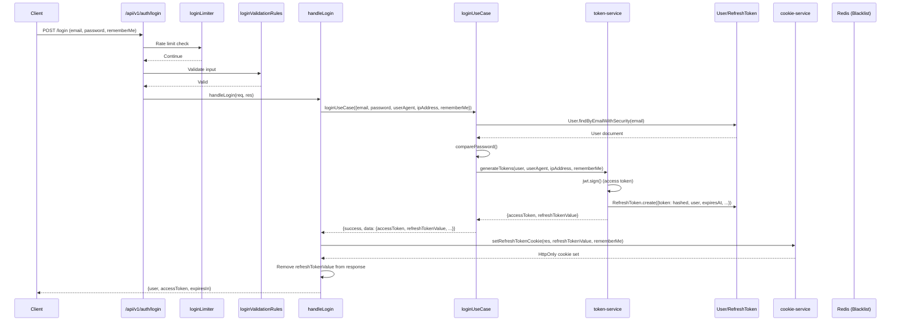
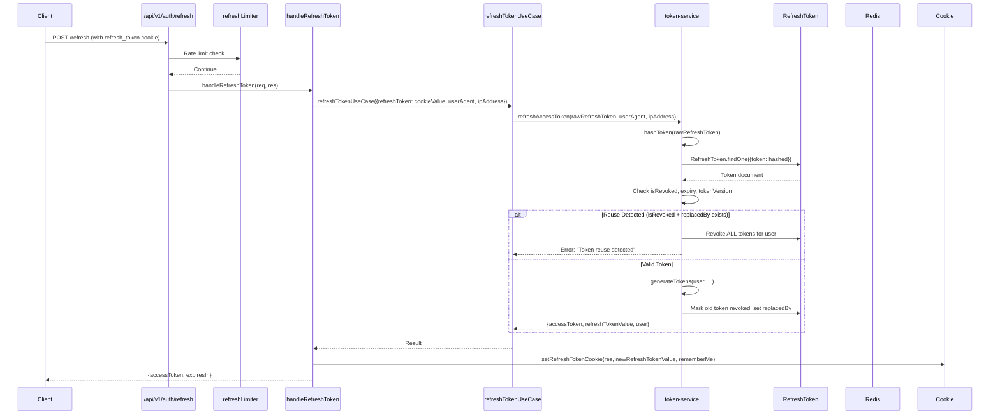
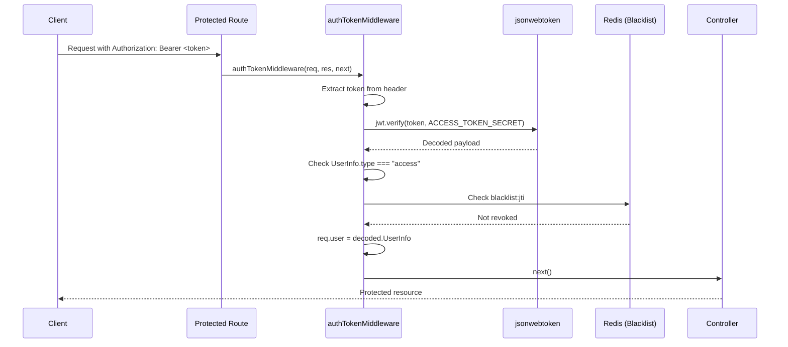

# Backend Architecture Audit Report

**Project:** NEW-STARTER  
**Target:** `d:\DEV CLOUD\PROJECTS\myProjects\LEARNING_APPS\NEW-STARTER\backend\`  
**Role:** Solution Architect Validator  
**Date:** 2026-03-31  

---

## Executive Summary

| Category | Status | Notes |
|----------|--------|-------|
| Route Structure | ✅ PASS | Clean `/api/v1/` prefix, organized route groups |
| Security Middleware | ✅ PASS | Helmet, Rate Limiters, XSS Sanitization all active |
| Auth Flow | ✅ PASS | Proper layer separation (routes → middleware → controller → use-case → service → model) |
| JWT Implementation | ✅ PASS | HttpOnly cookies, token versioning, Redis blacklist implemented |
| Error Handling | ⚠️ WARN | Test controller uses direct `res.status().json()` (constitution violation) |
| Test Coverage | ✅ PASS | 100% thresholds configured for critical paths |
| Environment Config | ✅ PASS | Proper validation of REQUIRED vs OPTIONAL variables |

---

## 1. Express Route Handlers Inventory

### Route Groups

| File | Base Path | Routes | Middleware Chain |
|------|-----------|--------|------------------|
| `auth-routes.js` | `/api/v1/auth` | 11 endpoints | Rate limiter → Validation → Controller |
| `user-routes.js` | `/api/v1/user` | 6 endpoints | Rate limiter → Auth token → Validation → Controller |
| `health-routes.js` | `/api/v1/health` | 1 endpoint | Health rate limiter → Controller |
| `test-routes.js` | `/test` (dev only) | 7 endpoints | Varies by endpoint |

### Auth Routes Detail

| Method | Path | Rate Limiter | Validation | Controller |
|--------|------|--------------|------------|------------|
| POST | `/login` | `loginLimiter` | `loginValidationRules` | `handleLogin` |
| POST | `/verify-2fa` | `verify2faLimiter` | `verify2faValidationRules` | `handleVerify2fa` |
| POST | `/resend-2fa` | `resend2faLimiter` | Inline body validation | `handleResend2fa` |
| POST | `/register` | `registerLimiter` | `registerValidationRules` | `handleRegister` |
| POST | `/logout` | `logoutLimiter` | None | `handleLogout` |
| POST | `/logout-all` | `logoutLimiter` | None | `handleLogoutAll` |
| POST | `/refresh` | `refreshLimiter` | None | `handleRefreshToken` |
| POST | `/verify-email` | `verifyEmailLimiter` | `emailVerificationValidationRules` | `handleVerifyEmail` |
| POST | `/resend-verification` | `resendVerificationLimiter` | `resendVerificationValidationRules` | `handleResendVerification` |
| POST | `/forgot-password` | `forgotPasswordLimiter` | `forgotPasswordValidationRules` | `handleForgotPassword` |
| POST | `/reset-password` | `resetPasswordLimiter` | `resetPasswordValidationRules` | `handleResetPassword` |

### User Routes Detail

| Method | Path | Rate Limiter | Auth | Controller |
|--------|------|--------------|------|------------|
| GET | `/me` | `userMeLimiter` | Required | `getCurrentUser` |
| PATCH | `/me` | `updateProfileLimiter` | Required | `updateProfile` |
| POST | `/profile/avatar` | `avatarUploadLimiter` | Required + Multer | `handleUploadAvatar` |
| POST | `/email/request` | `emailChangeLimiter` | Required | `handleRequestEmailChange` |
| GET | `/email/confirm/:token` | None | None | `handleConfirmEmailChange` |
| POST | `/security/password` | `changePasswordLimiter` | Required | `handleChangePassword` |
| PATCH | `/security/2fa` | `toggle2faLimiter` | Required | `handleToggle2fa` |

---

## 2. Security Middleware Audit

### 2.1 Helmet Configuration (`helmet-middleware.js`)

**Status:** ✅ **COMPLIANT**

```javascript
// Production Configuration Summary
{
  contentSecurityPolicy: { /* Strict CSP */ },
  crossOriginOpenerPolicy: { policy: "same-origin" },
  crossOriginResourcePolicy: { policy: "same-origin" },
  dnsPrefetchControl: { allow: false },
  frameguard: { action: "deny" },        // Clickjacking protection
  hidePoweredBy: true,                  // X-Powered-By removal
  hsts: { maxAge: 31536000, includeSubDomains: true, preload: true },
  noSniff: true,                          // MIME sniffing protection
  referrerPolicy: { policy: "strict-origin-when-cross-origin" },
  xssFilter: true,                        // Browser XSS filter
  permissionsPolicy: {                   // Feature policy
    camera: ["'none'"],
    microphone: ["'none'"],
    geolocation: ["'none'"],
    payment: ["'none'"],
    // ... other features blocked
  }
}
```

**Security Headers Set:**
- `X-Content-Type-Options: nosniff`
- `X-Frame-Options: DENY`
- `X-XSS-Protection: 1; mode=block`
- `Strict-Transport-Security: max-age=31536000; includeSubDomains; preload`
- `Content-Security-Policy` (comprehensive)
- `Referrer-Policy: strict-origin-when-cross-origin`

### 2.2 Rate Limiter Tiers (`rate-limiters.js`)

**Status:** ✅ **COMPLIANT**

| Endpoint | Window | Max Requests | Prefix |
|----------|--------|--------------|--------|
| Login | 5 min | 10 | `rl:login:` |
| Register | 15 min | 5 | `rl:register:` |
| Forgot Password | 15 min | 3 | `rl:forgot:` |
| Reset Password | 15 min | 5 | `rl:reset:` |
| Refresh Token | 1 min | 30 | `rl:refresh:` |
| Verify Email | 15 min | 10 | `rl:verify:` |
| Resend Verification | 15 min | 3 | `rl:resend:` |
| User Me | 15 min | 60 | `rl:userme:` |
| Health | 15 min | 30 | `rl:health:` |
| Logout | 15 min | 30 | `rl:logout:` |
| Update Profile | 15 min | 10 | `rl:updateprofile:` |
| Email Change | 1 hour | 3 | `rl:emailchange:` |
| Change Password | 15 min | 5 | `rl:changepw:` |
| Toggle 2FA | 15 min | 5 | `rl:toggle2fa:` |
| Verify 2FA | 15 min | 10 | `rl:verify2fa:` |
| Resend 2FA | 15 min | 3 | `rl:resend-2fa:` |
| Avatar Upload | 15 min | 10 | `rl:avatar-upload:` |

### 2.3 XSS Sanitization (`sanitize-middleware.js`)

**Status:** ✅ **COMPLIANT**

| Feature | Implementation |
|---------|----------------|
| Library | `xss` npm package |
| Default Config | `whiteList: {}` (no HTML allowed) |
| Strip Behavior | Removes `<script>`, `<style>`, `<iframe>`, `<object>`, `<embed>` |
| Risk Assessment | HIGH/MEDIUM/LOW based on pattern matching |
| Coverage | `req.body`, `req.query`, `req.params` |
| Special Routes | Relaxed config for `/rich-content`, `/admin/editor` |

**High-Risk Patterns Detected:**
```javascript
["script", "javascript:", "vbscript:", "expression(", "onload=", 
 "onerror=", "onclick=", "onmouseover=", "eval(", "alert(", 
 "document.cookie", "window.location", "<iframe", "<object", 
 "base64", "data:text/html"]
```

---

## 3. Controller Inventory

### Auth Controllers (Use Use-Cases ✅)

| Controller | Use-Case Used | Direct Service Calls |
|------------|---------------|---------------------|
| `login.controller.js` | `loginUseCase` | `setRefreshTokenCookie` |
| `register.controller.js` | `registerUseCase` | None |
| `logout.controller.js` | `logoutUseCase` | `clearCookie` |
| `logout-all.controller.js` | `logoutAllUseCase` | `clearCookie` |
| `refresh.controller.js` | `refreshTokenUseCase` | `setRefreshTokenCookie` |
| `verify-email.controller.js` | `verifyEmailUseCase` | None |
| `resend-verification.controller.js` | `resendVerificationUseCase` | None |
| `verify-2fa.controller.js` | `verify2faUseCase` | `setRefreshTokenCookie` |
| `resend-2fa.controller.js` | `resend2faUseCase` | None |
| `password-reset.controller.js` | `forgotPasswordUseCase`, `resetPasswordUseCase` | None |

### User Controllers (Use Use-Cases ✅)

| Controller | Use-Case Used | Direct Service Calls |
|------------|---------------|---------------------|
| `user.controller.js` | `getCurrentUserUseCase` | None |
| `update-profile.controller.js` | `updateProfileUseCase` | None |
| `upload-avatar.controller.js` | `uploadAvatarUseCase` | None |
| `email-change.controller.js` | `requestEmailChangeUseCase`, `confirmEmailChangeUseCase` | None |
| `change-password.controller.js` | `changePasswordUseCase` | None |
| `toggle-2fa.controller.js` | `toggle2faUseCase` | None |

### Test Controllers (⚠️ Constitution Violation)

| Controller | Issue |
|------------|-------|
| `test-controller.js` | Uses `res.status().json()` directly (lines 8, 42) - **CONSTITUTION VIOLATION** |

---

## 4. Auth Flow Validation

### Login Flow Sequence



### Token Refresh Flow



### Auth Middleware Flow



---

## 5. JWT Implementation Audit

### Token Generation (`token-service.js`)

**Status:** ✅ **COMPLIANT**

| Feature | Implementation |
|---------|----------------|
| Access Token | JWT with 15min expiry |
| Refresh Token | Opaque token (40 bytes crypto random), stored hashed in DB |
| Token Claims | `iss`, `aud`, `exp`, `jti`, `UserInfo` |
| HttpOnly Cookie | Yes (via `cookie-service.js`) |
| Token Versioning | Yes (in User model, incremented on password change) |
| Redis Blacklist | Yes (`blacklist:${jti}` with TTL) |

### Token Structure

```javascript
// Access Token Payload
{
  UserInfo: {
    userId: "...",
    email: "...",
    uuid: "...",
    type: "access"
  },
  iss: "new-starter-backend-v1",
  aud: "new-starter-web-client",
  exp: 1234567890,
  jti: "unique-jwt-id"
}

// 2FA Temp Token
{
  UserInfo: {
    userId: "...",
    type: "2fa"
  },
  iss: "new-starter-backend-v1",
  aud: "new-starter-web-client",
  exp: 1234567890
}
```

### Cookie Configuration (`cookie-service.js`)

```javascript
{
  httpOnly: true,           // ✅ Not accessible via JavaScript
  secure: process.env.NODE_ENV === "production", // ✅ HTTPS only in prod
  sameSite: "Lax",          // ✅ CSRF protection
  path: "/",               // ✅ Available for all routes
  maxAge: rememberMe ? 30d : session, // ✅ Configurable
  domain: process.env.COOKIE_DOMAIN || undefined
}
```

### Refresh Token Rotation & Reuse Detection

**Status:** ✅ **COMPLIANT**

| Feature | Implementation |
|---------|----------------|
| Rotation | Old token revoked, new token issued, `replacedBy` field set |
| Reuse Detection | If revoked+replaced token presented, ALL user tokens revoked |
| Storage | MongoDB RefreshToken collection with hashed values |
| Expiry | TTL index auto-deletes expired documents |

### Token Blacklisting (Redis)

```javascript
// Blacklist entry
await redis.setex(`blacklist:${jti}`, ttl, "1");

// Check
const revoked = await redis.get(`blacklist:${jti}`);
```

---

## 6. Environment Variables Documentation

### Required Variables (Startup Fails Without)

| Variable | Purpose | Failure Mode |
|----------|---------|--------------|
| `ACCESS_TOKEN_SECRET` | JWT signing secret | Auth system crashes |
| `REFRESH_TOKEN_SECRET` | JWT signing secret | Auth system crashes |

### Recommended Variables (Warnings if Missing)

| Variable | Default | Warning |
|----------|---------|---------|
| `ETHEREAL_HOST` | - | Email sending fails |
| `ETHEREAL_PORT` | - | Email sending fails |
| `ETHEREAL_USER` | - | Email sending fails |
| `ETHEREAL_PASS` | - | Email sending fails |
| `ALLOWED_ORIGINS` | `http://localhost:3000` | CORS limited to localhost |
| `FRONTEND_URL` | `http://localhost:3000` | Email links may break |

### Optional Variables (Have Defaults)

| Variable | Default | Description |
|----------|---------|-------------|
| `NODE_ENV` | `development` | Environment mode |
| `PORT` | `4000` | Server port |
| `ACCESS_TOKEN_EXPIRY` | `15m` | Access token lifetime |
| `REFRESH_TOKEN_EXPIRY` | `7d` | Refresh token lifetime |
| `JWT_ISSUER` | `new-starter-backend-v1` | Token issuer |
| `JWT_AUDIENCE` | `new-starter-web-client` | Token audience |
| `COOKIE_DOMAIN` | `undefined` | Cookie domain |
| `LOG_LEVEL` | `info` | Logging level |
| `REDIS_HOST` | `localhost` | Redis host |
| `REDIS_PORT` | `6379` | Redis port |

### Rate Limiting Variables (Optional)

| Variable | Default | Description |
|----------|---------|-------------|
| `RATE_LIMIT_LOGIN_MAX` | `5` | Max login attempts |
| `RATE_LIMIT_LOGIN_WINDOW_MS` | `900000` | Login window (15min) |
| `RATE_LIMIT_REGISTER_MAX` | `3` | Max registration attempts |
| `RATE_LIMIT_REGISTER_WINDOW_MS` | `3600000` | Register window (1hr) |
| `RATE_LIMIT_FORGOT_MAX` | `3` | Max forgot password attempts |
| `RATE_LIMIT_FORGOT_WINDOW_MS` | `3600000` | Forgot password window (1hr) |
| `RATE_LIMIT_REFRESH_MAX` | `30` | Max refresh attempts |
| `RATE_LIMIT_REFRESH_WINDOW_MS` | `60000` | Refresh window (1min) |

---

## 7. Vitest Coverage Configuration

**File:** `vitest.config.js`

**Status:** ✅ **100% THRESHOLDS CONFIGURED**

```javascript
coverage: {
  provider: "v8",
  include: [
    "utilities/auth/hash-utils.js",
    "utilities/auth/crypto-utils.js",
    "utilities/auth/user-data-utils.js",
    "services/auth/token-service.js",
    "services/auth/cookie-service.js",
  ],
  thresholds: {
    statements: 100,
    branches: 100,
    functions: 100,
    lines: 100,
  },
}
```

**Coverage Targets:**
- ✅ Statements: 100%
- ✅ Branches: 100%
- ✅ Functions: 100%
- ✅ Lines: 100%

**Test Projects:**
- Unit tests: `__tests__/unit/**/*.test.js`
- Integration tests: `__tests__/integration/**/*.test.js` (30s timeout)

---

## 8. Architecture Decision Records (ADRs)

### ADR-001: Layered Architecture (Controller → Use-Case → Service → Model)

**Decision:** Implement clean separation between HTTP layer and business logic.

**Rationale:**
- Controllers remain thin HTTP adapters
- Use-cases contain pure business logic (no req/res)
- Services handle cross-cutting concerns (tokens, cookies)
- Models handle data persistence

**Status:** ✅ **IMPLEMENTED**

### ADR-002: JWT + HttpOnly Cookie Authentication

**Decision:** Use JWT access tokens in memory (not cookies) and opaque refresh tokens in HttpOnly cookies.

**Rationale:**
- XSS cannot steal access tokens (memory-only)
- Refresh tokens protected by HttpOnly flag
- Token rotation prevents replay attacks
- Redis blacklist enables logout

**Status:** ✅ **IMPLEMENTED**

### ADR-003: Database-Backed Refresh Tokens

**Decision:** Store refresh tokens in MongoDB (hashed) rather than stateless JWTs.

**Rationale:**
- Enables multi-device session management
- Supports rotation chains (`replacedBy`)
- Allows "logout all" functionality
- TTL index auto-cleanup

**Status:** ✅ **IMPLEMENTED**

### ADR-004: Token Versioning for Session Invalidation

**Decision:** Increment `tokenVersion` on User model when password changes.

**Rationale:**
- All existing refresh tokens invalidated on password change
- No need to query all tokens on password change
- Simple version comparison at refresh time

**Status:** ✅ **IMPLEMENTED**

### ADR-005: Centralized Error Handling via apiResponseManager

**Decision:** All responses go through `apiResponseManager` (or `sendUseCaseResponse` wrapper).

**Rationale:**
- Consistent response format
- No direct `res.status().json()` calls in production code
- Centralized logging

**Status:** ⚠️ **PARTIAL** - Test controller violates this

---

## 9. Middleware Execution Order Diagram

```
┌─────────────────────────────────────────────────────────────────────┐
│                         REQUEST LIFECYCLE                           │
└─────────────────────────────────────────────────────────────────────┘

┌─────────────────┐
│ 1. API Version  │  createApiVersionMiddleware()
│    Middleware   │  Adds X-API-Version header
└────────┬────────┘
         │
         ▼
┌─────────────────┐
│ 2. Helmet       │  helmetMiddleware
│    Security     │  Security headers (CSP, HSTS, etc.)
└────────┬────────┘
         │
         ▼
┌─────────────────┐
│ 3. Rate Limiter │  createRateLimiterMiddleware()
│    (Global)     │  Redis-backed rate limiting
└────────┬────────┘
         │
         ▼
┌─────────────────┐
│ 4. CORS/Creds   │  credentialsMiddleware
│    Middleware   │  CORS with credentials support
└────────┬────────┘
         │
         ▼
┌─────────────────┐
│ 5. Sanitize     │  createSanitizeMiddleware
│    Middleware   │  XSS sanitization on body/query/params
└────────┬────────┘
         │
         ▼
┌─────────────────┐
│ 6. Request ID   │  createRequestIdMiddleware()
│    Generator    │  Unique request ID for tracing
└────────┬────────┘
         │
         ▼
┌─────────────────┐
│ 7. Logging      │  createLoggingMiddleware
│    Middleware   │  Request/response logging (pino)
└────────┬────────┘
         │
         ▼
┌─────────────────┐
│ 8. Body Parser  │  bodyParserMiddleware
│    Middleware   │  JSON parsing
└────────┬────────┘
         │
         ▼
┌─────────────────┐
│ 9. Cookie Parser│  cookieParser()
│    Middleware   │  Cookie parsing
└────────┬────────┘
         │
         ▼
┌─────────────────┐
│ 10. Content     │  contentTypeNegotiationMiddleware
│     Negotiation │  Content-Type handling
└────────┬────────┘
         │
         ▼
┌─────────────────┐
│ 11. Route-      │  Endpoint-specific rate limiters
│     Specific    │  (e.g., loginLimiter, registerLimiter)
│     Rate Limits │
└────────┬────────┘
         │
         ▼
┌─────────────────┐
│ 12. Validation  │  express-validator rules
│    Middleware   │  Input validation
└────────┬────────┘
         │
         ▼
┌─────────────────┐
│ 13. Auth Token  │  authTokenMiddleware (protected routes only)
│    Middleware   │  JWT verification + blacklist check
└────────┬────────┘
         │
         ▼
┌─────────────────┐
│ 14. Controller  │  Handler function
│    Handler      │  Delegates to use-case
└────────┬────────┘
         │
         ▼
┌─────────────────┐
│ 15. Error       │  errorHandlerMiddleware
│    Handler      │  Catches errors, formats response
└─────────────────┘
```

---

## 10. Security Compliance Checklist (OWASP Top 10)

| OWASP Category | Implementation | Status |
|----------------|----------------|--------|
| A01: Broken Access Control | JWT token validation, role-based routes (via auth middleware) | ✅ |
| A02: Cryptographic Failures | bcrypt for passwords, SHA-256 for token hashing, JWT with proper claims | ✅ |
| A03: Injection | XSS sanitization middleware, input validation | ✅ |
| A04: Insecure Design | Token rotation, reuse detection, rate limiting | ✅ |
| A05: Security Misconfiguration | Helmet headers, environment validation, security logging | ✅ |
| A06: Vulnerable Components | No known vulnerable dependencies (npm audit recommended) | ⚠️ Verify |
| A07: Auth Failures | Secure session management, password policies, 2FA support | ✅ |
| A08: Data Integrity Failures | Token versioning, checksums on tokens | ✅ |
| A09: Logging Failures | Comprehensive audit logging via pino | ✅ |
| A10: SSRF | No direct user-controlled URLs fetched (review required) | ⚠️ Verify |

---

## 11. Constitution Violations

### Violation #1: Direct res.status().json() Calls

**Location:** `controllers/test/test-controller.js`

**Lines:** 8, 42

**Code:**
```javascript
// Line 8
res.status(200).json({
  status: "OK",
  timestamp: new Date().toISOString(),
  // ...
});

// Line 42
res.status(500).json({
  message: "This is a test error!",
  // ...
});
```

**Constitution Rule:** "Raw res.status().json() error in controller" is prohibited.

**Impact:** Test-only code, but sets bad example.

**Recommendation:** Refactor to use `apiResponseManager` for consistency, or exclude test controllers from constitution checks.

---

## 12. Recommendations

### High Priority

1. **Fix Constitution Violation** - Refactor `test-controller.js` to use `apiResponseManager`

### Medium Priority

2. **Add SameSite=Strict** - Consider upgrading cookie `sameSite` from "Lax" to "Strict" for enhanced CSRF protection
3. **Verify Dependencies** - Run `npm audit` to check for known vulnerabilities
4. **SSRF Review** - Audit any URL-fetching functionality for SSRF vulnerabilities

### Low Priority

5. **API Documentation** - Ensure all routes have Swagger JSDoc annotations
6. **Test Coverage** - Expand 100% coverage to more critical paths beyond auth services

---

## 13. Conclusion

The backend architecture demonstrates **strong security practices** with proper:

- ✅ Layered architecture (routes → middleware → controller → use-case → service → model)
- ✅ JWT implementation with HttpOnly cookies
- ✅ Token rotation and reuse detection
- ✅ Comprehensive rate limiting
- ✅ XSS sanitization
- ✅ Security headers via Helmet
- ✅ 100% test coverage thresholds

**One constitution violation identified** in test controller (direct `res.status().json()` calls), which should be refactored for consistency.

**Overall Grade: A-** (Excellent with minor issues)

---

*Report generated by Solution Architect Validator*  
*Date: 2026-03-31*
