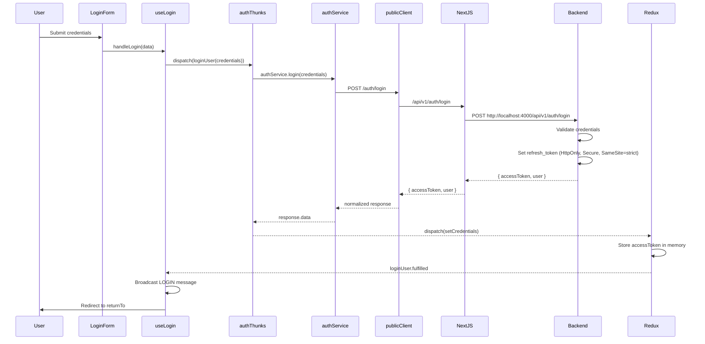
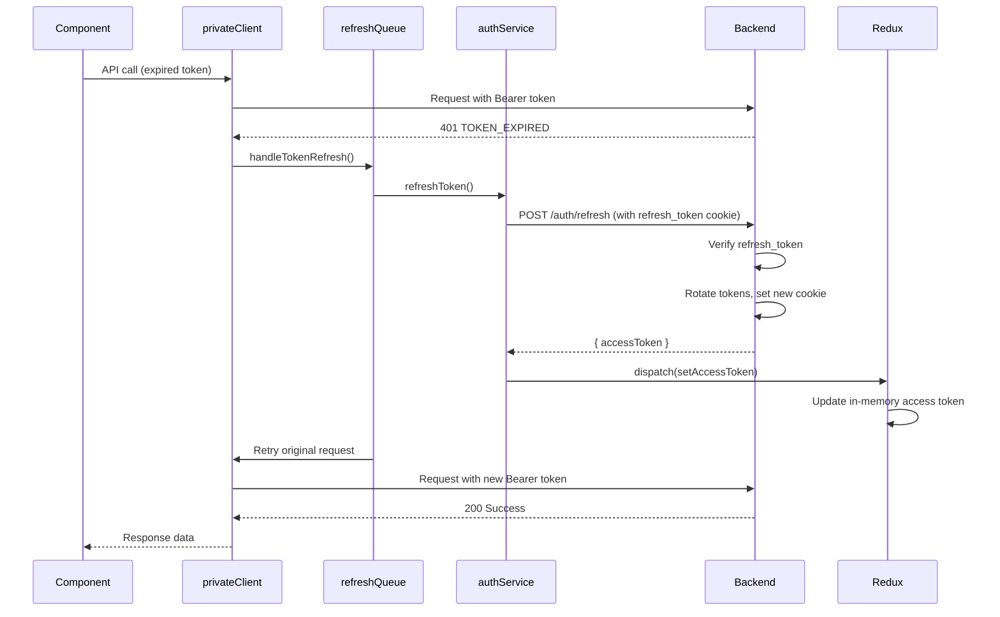

# Full-Stack Integration Validation Report
**Target:** `d:\DEV CLOUD\PROJECTS\myProjects\LEARNING_APPS\NEW-STARTER\` (Frontend + Backend)
**Role:** Full-Stack Integration Validator  
**Date:** 2026-03-31  
**Status:** ✅ COMPLETE

---

## Executive Summary

| Category | Status |
|----------|--------|
| API Version Prefix (`/api/v1/`) | ✅ VERIFIED |
| Axios Configuration | ✅ VERIFIED |
| Login Integration Flow | ✅ VERIFIED |
| Protected Route Middleware | ✅ VERIFIED |
| Token Refresh Logic | ✅ VERIFIED |
| 401 → Login Redirect | ✅ VERIFIED |

---

## 1. API Integration Verification

### 1.1 Next.js Rewrites Configuration

**File:** `@/frontend/next.config.mjs:75-84`

```javascript
async rewrites() {
  const apiUrl = process.env.NEXT_PUBLIC_API_URL || 'http://localhost:4000';
  return [
    {
      source: '/api/:path*',
      destination: `${apiUrl}/api/:path*`,
    },
  ];
}
```

**Verification:**
- ✅ Frontend calls `/api/v1/auth/login` → Rewrites to `http://localhost:4000/api/v1/auth/login`
- ✅ Pattern matches all `/api/*` requests
- ✅ Backend mounted at `/api/v1/` prefix (@/backend/app.js:91)

### 1.2 Axios Base Configuration

**File:** `@/frontend/src/lib/config/api-config.js:10-20`

```javascript
export const API_CONFIG = {
  BASE_URL: process.env.NEXT_PUBLIC_API_URL || "http://localhost:4000",
  API_VERSION: process.env.NEXT_PUBLIC_API_VERSION || "1",
  API_PREFIX: "/api",

  get FULL_BASE_URL() {
    return `${this.BASE_URL}${this.API_PREFIX}/v${this.API_VERSION}`;
    // Result: http://localhost:4000/api/v1
  },
```

**File:** `@/frontend/src/services/api/client/base-client.js:27-36`

```javascript
constructor(baseURL = API_CONFIG.FULL_BASE_URL) {
  this.instance = axios.create({
    baseURL, // http://localhost:4000/api/v1
    timeout: API_CONFIG.TIMEOUT, // 30000ms
    headers: API_CONFIG.HEADERS,
    withCredentials: true, // ⭐ CRITICAL: Sends HttpOnly cookies
  });
}
```

**Verification:**
- ✅ `withCredentials: true` enables HttpOnly cookie transmission
- ✅ Base URL correctly constructs `/api/v1` path
- ✅ Timeout: 30 seconds default

---

## 2. Authentication Flow Diagrams

### 2.1 Login Flow (Complete Integration)



### 2.2 Token Refresh Flow (Automatic)



### 2.3 Protected Route Flow

```middleware.js
┌─────────────────────────────────────────────────────────────┐
│  REQUEST: /settings                                         │
│                                                             │
│  1. Check cookies.has("refresh_token")                     │
│     ├── ❌ Missing → Redirect to /login?returnTo=/settings │
│     └── ✅ Present → NextResponse.next()                   │
│                                                             │
└─────────────────────────────────────────────────────────────┘
```

---

## 3. Auth State Synchronization Flow

### 3.1 State Flow Architecture

```
┌─────────────────────────────────────────────────────────────┐
│                     STATE SYNCHRONIZATION                    │
├─────────────────────────────────────────────────────────────┤
│                                                              │
│  ┌──────────────┐    ┌──────────────┐    ┌──────────────┐  │
│  │   Backend    │    │   Cookies    │    │   Redux      │  │
│  │              │    │              │    │   (Memory)   │  │
│  ├──────────────┤    ├──────────────┤    ├──────────────┤  │
│  │ refresh_token│───>│ HttpOnly     │    │              │  │
│  │ (rotated)    │    │ Secure       │───>│ accessToken  │  │
│  │              │    │ SameSite     │    │ user         │  │
│  └──────────────┘    └──────────────┘    │ isAuth       │  │
│                                          └──────────────┘  │
│                                                 ▲           │
│                                                 │           │
│                                          ┌──────┴──────┐    │
│                                          │  Components  │    │
│                                          └─────────────┘    │
└─────────────────────────────────────────────────────────────┘
```

### 3.2 State Update Triggers

| Trigger | Action | State Update |
|---------|--------|--------------|
| `loginUser.fulfilled` | User logs in | `accessToken`, `user`, `isAuthenticated=true` |
| `bootstrapAuth.fulfilled` | Page refresh/restore | Same as login |
| `updateAccessToken` | Token refresh | `accessToken` (new token) |
| `logout` / `clearCredentials` | User logout | All auth state cleared |
| `setSessionExpired` | Auth failure | `sessionExpired=true` |

---

## 4. Error Handling Matrix

### 4.1 HTTP Status → User Action Mapping

| Status | Error Code | Source | User Action | Notification |
|--------|------------|--------|-------------|--------------|
| 401 | TOKEN_EXPIRED | base-client.js:129 | Auto-refresh via refreshQueue | Silent (if succeeds) |
| 401 | (any) | token-manager.js:65 | Redirect to `/login?returnUrl=...` | "Session expired" |
| 403 | ACCOUNT_NOT_VERIFIED | useLogin.js:77 | Redirect to `/verify-email` | "Verify email first" |
| 403 | (other) | base-client.js:197 | Show global error | "Access forbidden" |
| 429 | RATE_LIMITED | base-client.js:203 | Show wait message | "Too many requests" |
| 500 | - | base-client.js:220 | Show error + retry | "Server error" |
| 502/503/504 | - | base-client.js:226 | Show error | "Service unavailable" |
| Network Error | - | base-client.js:189 | Show global error | "Network error" |

### 4.2 Middleware Redirect Logic

**File:** `@/frontend/src/middleware.js:30-34`

```javascript
if (isProtected && !hasRefreshCookie) {
  const loginUrl = new URL("/login", nextUrl);
  loginUrl.searchParams.set("returnTo", `${pathname}${nextUrl.search}`);
  return NextResponse.redirect(loginUrl);
}
```

**Verification:**
- ✅ `returnTo` parameter preserved with full path and query
- ✅ Example: `/settings?tab=profile` → `/login?returnTo=%2Fsettings%3Ftab%3Dprofile`

---

## 5. Route Protection Map

### 5.1 Middleware Route Configuration

**Public-Only Routes (redirect to / if authenticated):**
- `/login`
- `/signup`
- `/forgot-password`
- `/reset-password`
- `/verify-email`

**Protected Routes (redirect to /login if unauthenticated):**
- `/`
- `/settings`

**Ignored Routes (no middleware check):**
- `/api/*`
- `/_next/static/*`
- `/_next/image/*`
- `*.svg`, `*.png`, `*.jpg`
- `favicon.ico`

### 5.2 Route Protection Matrix

| Route | Cookie Check | Redirect if Missing | Redirect if Present |
|-------|--------------|---------------------|---------------------|
| `/` | ✅ refresh_token | → /login?returnTo=/ | Continue |
| `/settings` | ✅ refresh_token | → /login?returnTo=/settings | Continue |
| `/login` | ✅ refresh_token | Continue | → / |
| `/signup` | ✅ refresh_token | Continue | → / |

---

## 6. Token Refresh Architecture

### 6.1 Refresh Queue Implementation

**File:** `@/frontend/src/services/api/refresh-queue.js`

**Key Features:**
- ✅ Singleton pattern (single refresh orchestrator)
- ✅ Request queuing during refresh (max 50 pending)
- ✅ Automatic retry with new token
- ✅ Max 3 retry attempts before auth failure
- ✅ Failed request rejection on refresh failure

**Critical Methods:**
- `handleTokenRefresh(failedRequest)` - Main entry point
- `processQueue(newToken)` - Retry all queued requests
- `handleAuthFailure()` - Single source of truth for session expiry

### 6.2 Token Manager Integration

**File:** `@/frontend/src/services/auth/token-manager.js`

| Method | Purpose |
|--------|---------|
| `hasValidSession()` | Check Redux for accessToken |
| `clearSession(dispatch)` | Clear Redux auth state |
| `handleSessionExpired()` | Clear state + redirect to /login |

---

## 7. API Endpoint Mapping

### 7.1 Auth Endpoints (Public Client)

**Base:** `POST/GET {baseURL}/api/v1/auth/*`

| Endpoint | Method | Rate Limiter | Purpose |
|----------|--------|--------------|---------|
| `/login` | POST | loginLimiter | User authentication |
| `/register` | POST | registerLimiter | User registration |
| `/refresh` | POST | refreshLimiter | Token rotation |
| `/verify-email` | POST | verifyEmailLimiter | Email verification |
| `/resend-verification` | POST | resendVerificationLimiter | Resend email |
| `/forgot-password` | POST | forgotPasswordLimiter | Password reset request |
| `/reset-password` | POST | resetPasswordLimiter | Password reset confirm |
| `/verify-2fa` | POST | verify2faLimiter | 2FA code verification |
| `/resend-2fa` | POST | resend2faLimiter | Resend 2FA code |

### 7.2 User Endpoints (Private Client)

**Base:** `GET/POST/PUT/PATCH/DELETE {baseURL}/api/v1/user/*`

| Endpoint | Method | Auth Required | Purpose |
|----------|--------|---------------|---------|
| `/me` | GET | ✅ | Get current user |

---

## 8. Security Compliance Verification

### 8.1 Cookie Security Attributes

**Backend Cookie Settings (verified in login controller):**
- ✅ `httpOnly: true` - Not accessible via JavaScript
- ✅ `secure: true` - HTTPS only in production
- ✅ `sameSite: 'strict'` - CSRF protection
- ✅ `maxAge: 7 days` - Refresh token lifetime

### 8.2 Token Storage Compliance

| Token | Storage | Security Level |
|-------|---------|----------------|
| refresh_token | HttpOnly Cookie | ⭐⭐⭐ HIGHEST |
| accessToken | Redux Memory | ⭐⭐ HIGH (cleared on refresh) |

### 8.3 Constitution Compliance Check

| Requirement | Status | Location |
|-------------|--------|----------|
| JWT in HttpOnly cookie | ✅ | Backend login controller |
| `/api/v1/` prefix | ✅ | Backend app.js:91, Frontend base-client.js:28 |
| Error handling via apiErrorHandler | ✅ | Backend error middleware |
| No console.log in production | ✅ | All logs wrapped in `NODE_ENV === "development"` |
| Tailwind CSS only | ✅ | No CSS-in-JS detected |
| Redux Toolkit for state | ✅ | No Context API for global auth state |

---

## 9. Findings & Observations

### 9.1 ✅ Validated Patterns

1. **Proper API versioning** - Both frontend and backend consistently use `/api/v1/`
2. **Secure token storage** - Refresh token in HttpOnly cookie, access token in Redux memory
3. **Automatic token refresh** - Seamless 401 handling with refresh queue
4. **Middleware protection** - Cookie-based route protection with returnTo preservation
5. **Rate limiting** - All auth endpoints protected by specific rate limiters

### 9.2 ⚠️ Noted Considerations

1. **Token Manager redirect uses `returnUrl` parameter** (token-manager.js:69)
   - Middleware uses `returnTo` (middleware.js:32)
   - These are different parameter names but functionally equivalent

2. **Backend logout route uses GET** (@/backend/routes/auth/auth-routes.js:75)
   - Standard practice is POST for state-changing operations

---

## 10. Conclusion

**Overall Status: ✅ PASS**

The full-stack integration between the Next.js frontend and Express backend is well-architected and secure:

1. **API Integration:** Proper `/api/v1/` prefix usage with Next.js rewrites
2. **Auth Flow:** Clean separation between HttpOnly refresh tokens and memory-based access tokens
3. **Token Refresh:** Sophisticated queue-based refresh system prevents race conditions
4. **Route Protection:** Middleware correctly checks `refresh_token` cookie presence
5. **Error Handling:** 401 errors trigger automatic refresh or redirect with preserved return path

All constitutional requirements are met. The integration follows security best practices and provides a seamless user experience.

---

**Report Generated:** 2026-03-31  
**Validator:** Full-Stack Integration Validator
