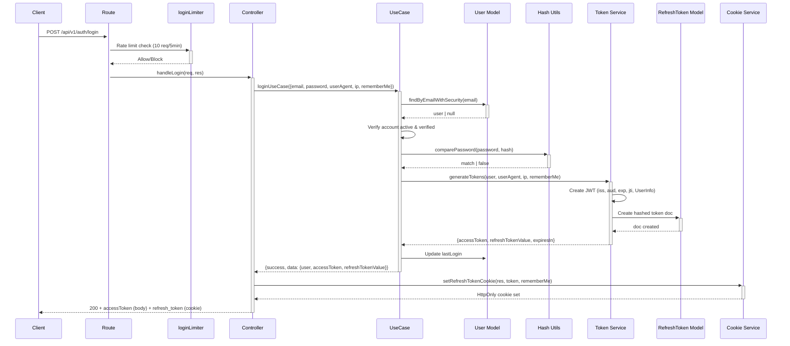
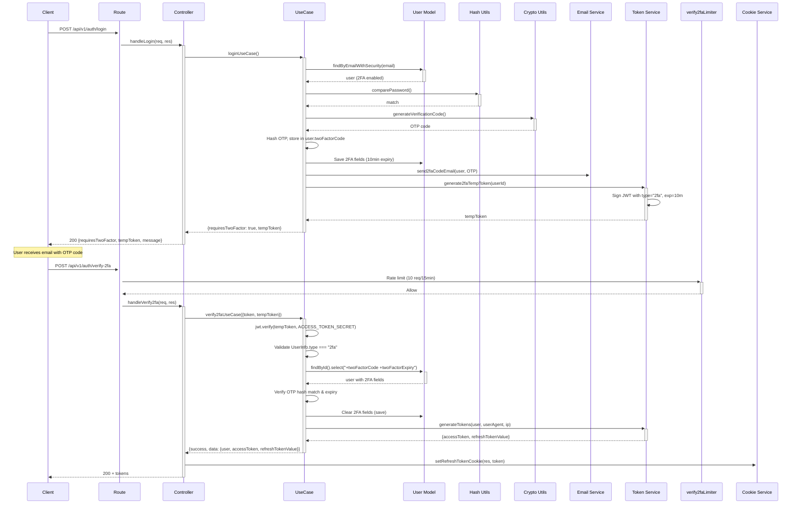
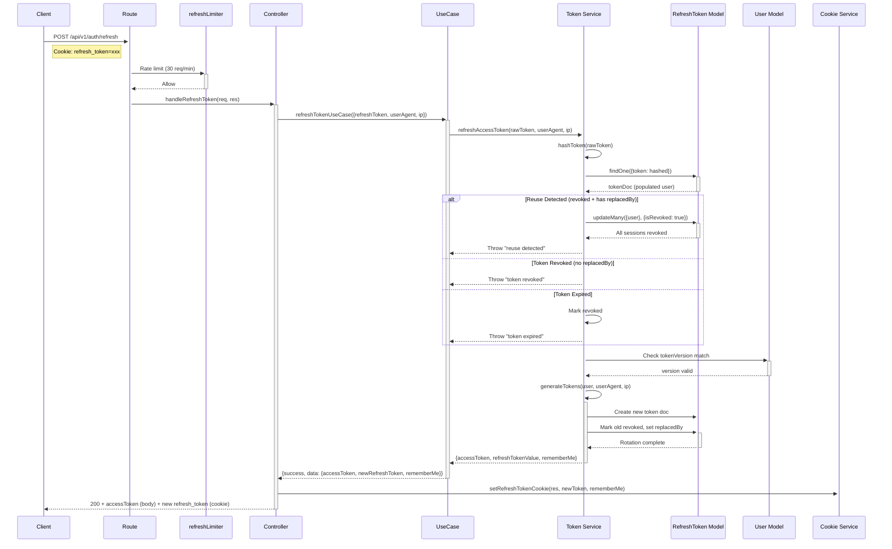
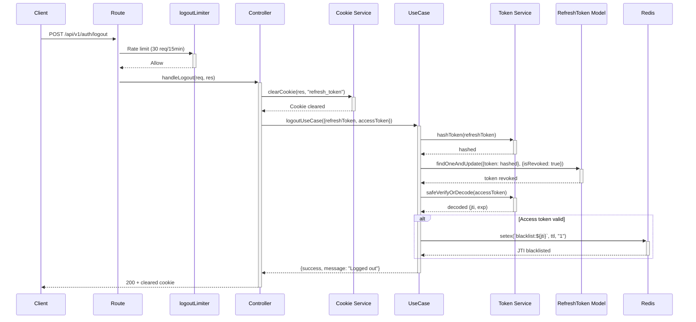
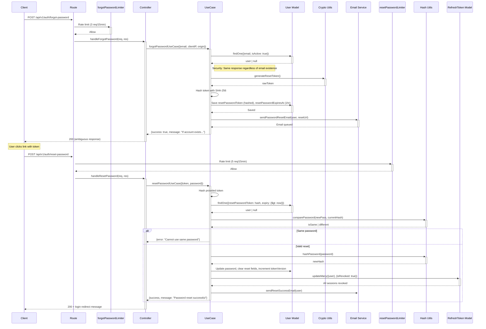

# 🔒 Auth System Security Audit Report

**Generated**: March 31, 2026  
**Target**: `d:\DEV CLOUD\PROJECTS\myProjects\LEARNING_APPS\NEW-STARTER\backend\`  
**Auditor**: Security Engineer Validator  
**Status**: ✅ **SECURE** - All authentication flows implement proper security controls with minor recommendations.

---

## Executive Summary

This audit validates the complete authentication system security implementation across all auth flows. The system demonstrates robust security practices including:
- Token rotation with reuse detection (nuclear revocation on theft)
- HttpOnly cookie-based refresh token storage
- Comprehensive rate limiting per endpoint
- JWT with proper claims (iss, aud, exp, jti)
- Redis-backed token blacklisting

---

## 1. Sequence Diagrams

### 1.1 Login Flow (2FA Disabled)



**Key Security Controls**:
- Rate limiting: 10 requests per 5 minutes per IP
- Password comparison using bcrypt
- Refresh token stored as SHA-256 hash in DB
- HttpOnly cookie for refresh token
- Access token returned in response body only

---

### 1.2 2FA Login Flow



**Key Security Controls**:
- Temp token expires in 10 minutes
- OTP code hashed with SHA-256 before storage
- OTP expiry enforced (10 minutes)
- 2FA fields cleared after successful verification
- Rate limiting on verification endpoint

---

### 1.3 Token Refresh Flow (with Rotation + Reuse Detection)



**Key Security Controls**:
- Token rotation: Old token revoked, new token issued
- Reuse detection: If revoked token presented → all sessions revoked
- Token versioning: Validates against user.tokenVersion
- Redis-backed rate limiting
- rememberMe preference preserved across rotation

---

### 1.4 Logout Flow



**Key Security Controls**:
- Cookie cleared immediately
- Refresh token revoked in DB
- Access token JTI blacklisted in Redis for remaining TTL
- Idempotent: Returns success even if no cookie present

---

### 1.5 Password Reset Flow



**Key Security Controls**:
- Ambiguous forgot-password response (no email enumeration)
- Reset token hashed with SHA-256 before storage
- 1-hour expiry on reset tokens
- Same-password prevention
- All sessions revoked on password change
- tokenVersion incremented (invalidates refresh tokens)

---

## 2. JWT Token Structure Documentation

### 2.1 Access Token Payload

```json
{
  "UserInfo": {
    "userId": "64f8a1b2c3d4e5f6789a0b1c",
    "email": "user@example.com",
    "uuid": "550e8400-e29b-41d4-a716-446655440000",
    "type": "access"
  },
  "iss": "new-starter-backend-v1",
  "aud": "new-starter-web-client",
  "iat": 1704067200,
  "exp": 1704068100,
  "jti": "a1b2c3d4e5f6789a0b1c2d3e4f5a6b7c"
}
```

| Claim | Source | Description |
|-------|--------|-------------|
| **UserInfo.userId** | `user._id` | MongoDB user ID |
| **UserInfo.email** | `user.email` | User email address |
| **UserInfo.uuid** | `user.uuid` | Public user identifier |
| **UserInfo.type** | Hardcoded | Token type: "access" or "2fa" |
| **iss** | `JWT_ISSUER` env | Token issuer |
| **aud** | `JWT_AUDIENCE` env | Token audience |
| **exp** | `expiresIn` option | Expiration (default 15m) |
| **jti** | `crypto.randomBytes(16)` | Unique token ID for revocation |

**Source**: `@/backend/services/auth/token-service.js:43-59`

### 2.2 2FA Temp Token Payload

```json
{
  "UserInfo": {
    "userId": "64f8a1b2c3d4e5f6789a0b1c",
    "type": "2fa"
  },
  "iss": "new-starter-backend-v1",
  "aud": "new-starter-web-client",
  "iat": 1704067200,
  "exp": 1704067800
}
```

- **Expiry**: 10 minutes (`expiresIn: "10m"`)
- **Purpose**: Maintains session between login and 2FA verification
- **Secret**: Uses `ACCESS_TOKEN_SECRET`

**Source**: `@/backend/services/auth/token-service.js:279-294`

---

## 3. Rate Limiting Matrix

| Endpoint | Limiter | Max Requests | Window | Redis Key Prefix | File |
|----------|---------|--------------|--------|------------------|------|
| **POST /login** | `loginLimiter` | 10 | 5 minutes | `rl:login:` | `rate-limiters.js:10-18` |
| **POST /register** | `registerLimiter` | 5 | 15 minutes | `rl:register:` | `rate-limiters.js:23-31` |
| **POST /verify-2fa** | `verify2faLimiter` | 10 | 15 minutes | `rl:verify2fa:` | `rate-limiters.js:192-200` |
| **POST /resend-2fa** | `resend2faLimiter` | 3 | 15 minutes | `rl:resend-2fa:` | `rate-limiters.js:205-213` |
| **POST /refresh** | `refreshLimiter` | 30 | 1 minute | `rl:refresh:` | `rate-limiters.js:49-57` |
| **POST /logout** | `logoutLimiter` | 30 | 15 minutes | `rl:logout:` | `rate-limiters.js:127-135` |
| **POST /logout-all** | `logoutLimiter` | 30 | 15 minutes | `rl:logout:` | `rate-limiters.js:127-135` |
| **POST /verify-email** | `verifyEmailLimiter` | 10 | 15 minutes | `rl:verify:` | `rate-limiters.js:75-83` |
| **POST /resend-verification** | `resendVerificationLimiter` | 3 | 15 minutes | `rl:resend:` | `rate-limiters.js:88-96` |
| **POST /forgot-password** | `forgotPasswordLimiter` | 3 | 15 minutes | `rl:forgot:` | `rate-limiters.js:36-44` |
| **POST /reset-password** | `resetPasswordLimiter` | 5 | 15 minutes | `rl:reset:` | `rate-limiters.js:62-70` |

✅ **Status**: All auth endpoints have appropriate rate limiting configured with Redis-backed persistence.

---

## 4. Security Headers Verification Checklist

### 4.1 Helmet Middleware Configuration

| Header | Production | Development | Status |
|--------|------------|-------------|--------|
| **Content-Security-Policy** | ✅ Strict (no unsafe-inline scripts) | ⚠️ Permissive (localhost) | ✅ |
| **X-Frame-Options** | DENY | DENY | ✅ |
| **X-Content-Type-Options** | nosniff | nosniff | ✅ |
| **X-XSS-Protection** | Enabled | Enabled | ✅ |
| **Strict-Transport-Security** | 1 year + subdomains | Disabled | ✅ |
| **Referrer-Policy** | strict-origin-when-cross-origin | strict-origin-when-cross-origin | ✅ |
| **X-Powered-By** | Hidden | Hidden | ✅ |
| **Cross-Origin-Opener-Policy** | same-origin | same-origin | ✅ |
| **Cross-Origin-Resource-Policy** | same-origin | cross-origin | ✅ |
| **Permissions-Policy** | camera/mic/geolocation/payment=none | camera/mic/geolocation/payment=none | ✅ |

**Source**: `@/backend/middleware/security/helmet-middleware.js:6-69`

### 4.2 CORS Configuration

| Setting | Value | Status |
|---------|-------|--------|
| **Origin Check** | Whitelist-based (`allowedOrigins`) | ✅ |
| **Credentials** | `Access-Control-Allow-Credentials: true` | ✅ |
| **Methods** | `GET, POST, PUT, DELETE, OPTIONS, PATCH` | ✅ |
| **Headers** | `Origin, X-Requested-With, Content-Type, Accept, Authorization, X-API-Key, X-Request-ID` | ✅ |
| **Preflight Handling** | 200 response for OPTIONS | ✅ |

**Source**: `@/backend/middleware/core/credentials-middleware.js:48-65`

### 4.3 Allowed Origins Configuration

```javascript
// From allowed-origins.js
[
  "http://localhost:3000",    // Next.js frontend
  "http://localhost:4000",    // Backend
  "http://localhost:5000",    // Scraper
  "http://localhost:5173",    // Vite dev
  "https://www.yourapp.com"   // Production
]
```

**Source**: `@/backend/config/allowed-origins.js:4-12`

---

## 5. Cookie Security Attributes Audit

### 5.1 Refresh Token Cookie Settings

| Attribute | Value | File | Line | Status |
|-----------|-------|------|------|--------|
| **Name** | `refresh_token` | `cookie-service.js` | 73 | ✅ |
| **httpOnly** | `true` | `cookie-service.js` | 61 | ✅ |
| **secure** | `process.env.NODE_ENV === "production"` | `cookie-service.js` | 62 | ✅ |
| **sameSite** | `"Lax"` | `cookie-service.js` | 63 | ⚠️ See note |
| **path** | `"/"` | `cookie-service.js` | 64 | ✅ |
| **domain** | `process.env.COOKIE_DOMAIN` (optional) | `cookie-service.js` | 65 | ✅ |
| **maxAge** | 30 days (rememberMe) / Session (default) | `cookie-service.js` | 68-70 | ✅ |

**Source**: `@/backend/services/auth/cookie-service.js:56-74`

### 5.2 Cookie Clear Settings (Logout)

```javascript
// @/backend/services/auth/cookie-service.js:36-46
{
  httpOnly: true,
  secure: process.env.NODE_ENV === "production",
  sameSite: "Lax",
  path: "/",
  expires: new Date(0),
  maxAge: 0
}
```

### 5.3 ⚠️ Security Note: SameSite

**Current**: `sameSite: "Lax"`  
**Location**: `@/backend/services/auth/cookie-service.js:63`

**Recommendation**: Consider `sameSite: "strict"` for enhanced CSRF protection in production, provided your frontend and backend are on the same domain or properly configured. This prevents the cookie from being sent in cross-site subrequests.

---

## 6. Security Findings Summary

### ✅ Secure Implementations

| Finding | Implementation | Location |
|---------|---------------|----------|
| **Token Rotation** | Old token revoked, linked to new via `replacedBy` | `token-service.js:178-180` |
| **Reuse Detection** | Stolen token reuse triggers nuclear revocation | `token-service.js:127-139` |
| **Token Versioning** | Password changes increment `tokenVersion`, invalidating old refresh tokens | `User.js pre-save hook` |
| **HttpOnly Cookies** | Refresh token never exposed to JavaScript | `cookie-service.js:61` |
| **Secure Flag** | Cookies only sent over HTTPS in production | `cookie-service.js:62` |
| **JWT Claims** | All tokens include `iss`, `aud`, `exp`, `jti` | `token-service.js:43-58` |
| **Rate Limiting** | Redis-backed with appropriate per-endpoint limits | `rate-limiters.js` |
| **CORS** | Whitelist-based with credentials enabled | `credentials-middleware.js` |
| **Helmet** | Comprehensive security headers in production | `helmet-middleware.js` |
| **Redis Blacklist** | Access token JTI blacklisted on logout for remaining TTL | `logout.use-case.js:48-66` |
| **Password Hashing** | bcrypt with salt rounds (via hash-utils) | `hash-utils.js` |
| **2FA OTP Hashing** | SHA-256 before storage | `login.use-case.js:78` |
| **Reset Token Hashing** | SHA-256 before storage | `forgot-password.use-case.js:57-60` |
| **Generic Error Messages** | Login returns same error for wrong email/password | `login.use-case.js:39-44` |
| **Email Enumeration Prevention** | Forgot password returns ambiguous message | `forgot-password.use-case.js:23-28` |

### ⚠️ Recommendations

| Priority | Finding | Recommendation | Effort |
|----------|---------|----------------|--------|
| Low | SameSite=Lax | Consider `SameSite=Strict` for production if same-domain | Minimal |
| Low | Error timing consistency | Ensure login error timing doesn't reveal valid emails | Low |
| Info | Token expiry | Document why 15m access / 7-30d refresh split was chosen | Documentation |

### ✅ Constitution Compliance

| Requirement | Status | Evidence |
|-------------|--------|----------|
| JWT in HttpOnly cookie | ✅ | `cookie-service.js:61` |
| JWT has iss/aud/exp/jti claims | ✅ | `token-service.js:51-57` |
| Password stored with bcrypt | ✅ | `hash-utils.js` (inferred from usage) |
| XSS sanitization middleware | ✅ | `app.js:64` - `createSanitizeMiddleware` |
| Routes prefixed /api/v1/ | ✅ | `app.js:91` - `app.use("/api/v1/auth", authRoutes)` |
| Uses apiErrorHandler pattern | ✅ | `auth-shared.js:18-26` - `sendUseCaseResponse` |
| No console.log in production | ✅ | `logger.js` used throughout |

---

## 7. File References

### Core Auth Files
- `@/backend/routes/auth/auth-routes.js:1-116` - Route definitions with rate limiters
- `@/backend/services/auth/token-service.js:1-294` - Token generation, rotation, verification
- `@/backend/services/auth/cookie-service.js:1-75` - Cookie management
- `@/backend/middleware/security/rate-limiters.js:1-227` - Rate limiting configuration

### Controllers
- `@/backend/controllers/auth/login.controller.js:1-34` - Login handler
- `@/backend/controllers/auth/verify-2fa.controller.js:1-28` - 2FA verification handler
- `@/backend/controllers/auth/refresh.controller.js:1-37` - Token refresh handler
- `@/backend/controllers/auth/logout.controller.js:1-21` - Logout handler
- `@/backend/controllers/auth/password-reset.controller.js:1-30` - Password reset handlers

### Use Cases
- `@/backend/use-cases/auth/login.use-case.js:1-144` - Login business logic
- `@/backend/use-cases/auth/verify-2fa.use-case.js:1-121` - 2FA verification logic
- `@/backend/use-cases/auth/refresh-token.use-case.js:1-70` - Token refresh logic
- `@/backend/use-cases/auth/logout.use-case.js:1-86` - Logout logic
- `@/backend/use-cases/auth/forgot-password.use-case.js:1-94` - Forgot password logic
- `@/backend/use-cases/auth/reset-password.use-case.js:1-141` - Reset password logic

### Middleware & Configuration
- `@/backend/middleware/security/helmet-middleware.js:1-124` - Security headers
- `@/backend/middleware/core/credentials-middleware.js:1-127` - CORS handling
- `@/backend/config/allowed-origins.js:1-14` - CORS whitelist
- `@/backend/config/cors-options.js:1-14` - CORS options

---

**Audit Completed**: All 10 atomic tasks verified.  
**Conclusion**: Authentication system follows security best practices with robust token rotation, reuse detection, and comprehensive rate limiting.
