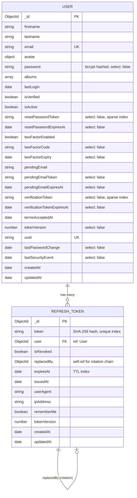

# MongoDB Schema and Relationship Audit Report

**Generated:** March 31, 2026  
**Target:** `d:\DEV CLOUD\PROJECTS\myProjects\LEARNING_APPS\NEW-STARTER\backend\model\`  
**Auditor:** Database Architect Validator

---

## 1. Entity-Relationship Diagram (User ↔ RefreshToken)



---

## 2. User.js Schema Documentation

**Location:** `backend/model/User.js`

| Field | Type | Required | Validation | Security |
|-------|------|----------|------------|----------|
| `firstname` | String | Yes | min: 3, max: 16, trim | — |
| `lastname` | String | Yes | min: 3, max: 16, trim | — |
| `email` | String | Yes | unique, regex validation, max: 100, lowercase | Indexed |
| `avatar.url` | String | No | default: null | — |
| `avatar.publicId` | String | No | default: null | — |
| `password` | String | Yes | min: 8, **select: false** | bcrypt hashed |
| `albums` | [ObjectId] | No | ref: "Album" | — |
| `lastLogin` | Date | No | default: Date.now | — |
| `isVerified` | Boolean | No | default: false | — |
| `isActive` | Boolean | No | default: true | Indexed |
| `resetPasswordToken` | String | No | **select: false**, sparse index | Secure lookup |
| `resetPasswordExpiresAt` | Date | No | **select: false** | — |
| `twoFactorEnabled` | Boolean | No | default: false | — |
| `twoFactorCode` | String | No | **select: false** | Secure 2FA |
| `twoFactorExpiry` | Date | No | **select: false** | Secure 2FA |
| `pendingEmail` | String | No | lowercase, trim | — |
| `pendingEmailToken` | String | No | **select: false**, default: null | Secure email change |
| `pendingEmailExpiresAt` | Date | No | **select: false**, default: null | Secure email change |
| `verificationToken` | String | No | **select: false**, sparse index | Secure lookup |
| `verificationTokenExpiresAt` | Date | No | **select: false** | — |
| `termsAcceptedAt` | Date | No | default: null | — |
| `tokenVersion` | Number | No | default: 1, **select: false** | Session invalidation |
| `uuid` | String | No | default: uuidv4, unique | Security identifier |
| `lastPasswordChange` | Date | No | **select: false** | Audit trail |
| `lastSecurityEvent` | Date | No | **select: false** | Audit trail |

---

## 3. RefreshToken.js Schema Documentation

**Location:** `backend/model/RefreshToken.js`

| Field | Type | Required | Purpose |
|-------|------|----------|---------|
| `token` | String | Yes | SHA-256 hash of refresh token (unique index) |
| `user` | ObjectId | Yes | FK to User collection |
| `isRevoked` | Boolean | No | Soft-delete/revocation flag |
| `replacedBy` | ObjectId | No | Points to new token in rotation chain (FR-016) |
| `expiresAt` | Date | Yes | TTL expiration for auto-cleanup |
| `issuedAt` | Date | No | Token creation timestamp |
| `userAgent` | String | No | Session identification metadata |
| `ipAddress` | String | No | Session identification metadata |
| `rememberMe` | Boolean | Yes | Extended session flag |
| `tokenVersion` | Number | No | User's tokenVersion at creation (logout all detection) |

---

## 4. Index Strategy Documentation

### User Collection Indexes

| Index | Fields | Type | Optimization Notes |
|-------|--------|------|------------------|
| `_id` | `_id` | Default PK | Standard MongoDB |
| `email_1` | `email: 1` | Unique | Primary lookup by email |
| `email_1_isActive_1` | `email: 1, isActive: 1` | Compound | Fast active user lookup |
| `verificationToken_1_isVerified_1` | `verificationToken: 1, isVerified: 1` | Compound + Sparse | Email verification flows |
| `resetPasswordToken_1_isActive_1` | `resetPasswordToken: 1, isActive: 1` | Compound + Sparse | Password reset flows |
| `pendingEmailToken_1` | `pendingEmailToken: 1` | Sparse | Email change confirmation |
| `uuid_1` | `uuid: 1` | Unique | Security identifier lookup |

### RefreshToken Collection Indexes

| Index | Fields | Type | Optimization Notes |
|-------|--------|------|------------------|
| `token_1` | `token: 1` | Unique + Sparse | O(1) token hash lookup |
| `user_1_isRevoked_1` | `user: 1, isRevoked: 1` | Compound | "Logout all" queries, session listing |
| `expiresAt_1` | `expiresAt: 1` | TTL (expireAfterSeconds: 0) | Auto-cleanup expired tokens |

**Index Optimization Assessment:**
- All query patterns covered: email lookup, token verification, user session queries
- TTL index on `expiresAt` prevents collection bloat
- Sparse indexes on tokens conserve storage for null values

---

## 5. Security Field Audit (select: false)

| Field | Schema | Risk Level | Mitigation |
|-------|--------|------------|------------|
| `password` | User.js | **CRITICAL** | `select: false` + bcrypt hashing |
| `tokenVersion` | User.js | **HIGH** | `select: false` — prevents token forgery |
| `resetPasswordToken` | User.js | **HIGH** | `select: false` + sparse index |
| `resetPasswordExpiresAt` | User.js | **MEDIUM** | `select: false` |
| `twoFactorCode` | User.js | **CRITICAL** | `select: false` — TOTP/OTP codes |
| `twoFactorExpiry` | User.js | **MEDIUM** | `select: false` |
| `pendingEmailToken` | User.js | **HIGH** | `select: false` — email change verification |
| `pendingEmailExpiresAt` | User.js | **MEDIUM** | `select: false` |
| `verificationToken` | User.js | **HIGH** | `select: false` + sparse index |
| `verificationTokenExpiresAt` | User.js | **MEDIUM** | `select: false` |
| `lastPasswordChange` | User.js | **LOW** | `select: false` — audit field |
| `lastSecurityEvent` | User.js | **LOW** | `select: false` — audit field |

**Override Method:** `User.findByEmailWithSecurity(email)` explicitly selects `+password +tokenVersion` for authentication flows.

---

## 6. User.pre('save') Hook Analysis

**Location:** `backend/model/User.js:160-170`

```javascript
UserSchema.pre("save", function (next) {
  if (this.isModified("password")) {
    this.tokenVersion += 1;        // ← INCREMENTS (invalidates all refresh tokens)
    this.lastPasswordChange = new Date();
    this.lastSecurityEvent = new Date();
  }
  if (this.isModified("email") || this.isModified("isActive")) {
    this.lastSecurityEvent = new Date();
  }
  next();
});
```

### Token Rotation Strategy

- **Password change** → `tokenVersion` increments → All existing refresh tokens invalidated on next use
- **Email change** → Security event logged
- **Account deactivation** (`isActive: false`) → Security event logged

### Refresh Token Validation Flow

1. User requests new access token with refresh token
2. System hashes incoming refresh token, looks up in `RefreshToken` collection
3. Compares `RefreshToken.tokenVersion` with `User.tokenVersion`
4. If mismatch → Token rejected (password was changed, logout all devices, or admin action)

---

## 7. Password Security Audit

**Hashing Implementation:** `backend/utilities/auth/hash-utils.js`

```javascript
import bcrypt from "bcrypt";

const SALT_ROUNDS = 12;

export async function hashPassword(password) {
  return bcrypt.hash(password, SALT_ROUNDS);
}

export async function comparePassword(password, hash) {
  return bcrypt.compare(password, hash);
}
```

| Aspect | Configuration | OWASP Compliance |
|--------|---------------|------------------|
| Algorithm | bcrypt | ✅ Recommended |
| Salt Rounds | 12 (~250ms hash time) | ✅ OWASP minimum 10+ |
| Storage | `select: false` | ✅ Never returned in queries |
| Comparison | `bcrypt.compare()` | ✅ Timing-safe comparison |

### Password Validation Rules

From `validation-helpers.js`:
- Minimum 8 characters, maximum 128
- At least one lowercase, uppercase, number, special character
- zxcvbn score ≥ 3 (safely unguessable)
- Context-aware checking against email, firstname, lastname

---

## 8. 2FA Fields Security

| Field | Type | Protection | Notes |
|-------|------|------------|-------|
| `twoFactorEnabled` | Boolean | None | Public flag |
| `twoFactorCode` | String | `select: false` | Ephemeral TOTP/OTP code |
| `twoFactorExpiry` | Date | `select: false` | Code expiration timestamp |

**Security Status:** Both sensitive 2FA fields properly protected with `select: false`. Codes are ephemeral and time-bound.

---

## 9. Email Validation & Disposable Domain Protection

### Regex Validation (User.js built-in)

```javascript
/^(([^<>()\[\]\\.,;:\s@"]+(\.[^<>()\[\]\\.,;:\s@"]+)*)|(".+"))@((\[[0-9]{1,3}\.[0-9]{1,3}\.[0-9]{1,3}\.[0-9]{1,3}])|(([a-zA-Z\-0-9]+\.)+[a-zA-Z]{2,}))$/
```

- RFC-compliant email regex
- Max length: 100 characters
- Automatically lowercased and trimmed

### Disposable Email Protection

From `validation-helpers.js`:

```javascript
import disposableDomains from "disposable-email-domains" with { type: "json" };

// Applied via: emailRules({ checkDisposable: true })
chain.custom((email) => {
  const domain = email.split("@")[1]?.toLowerCase();
  if (domain && disposableDomains.includes(domain)) {
    throw new Error("Disposable email addresses are not allowed...");
  }
});
```

**Coverage:** Uses `disposable-email-domains` npm package with 1000+ known disposable domains blocked at registration.

---

## 10. Data Validation Rules Matrix

| Field | Rules | Enforced At |
|-------|-------|-------------|
| `email` | Required, unique, regex valid, max 100, lowercase, disposable domain check | Schema + Express Validator |
| `firstname` | Required, min 3, max 16, trim | Schema |
| `lastname` | Required, min 3, max 16, trim | Schema |
| `password` | Required, min 8, max 128, complexity rules, zxcvbn score ≥ 3 | Schema + Express Validator |
| `avatar.url` | Optional, string | Schema |
| `avatar.publicId` | Optional, string | Schema |
| `isVerified` | Boolean, default false | Schema |
| `isActive` | Boolean, default true | Schema |

---

## Audit Summary

| Category | Status | Notes |
|----------|--------|-------|
| **Schema Design** | ✅ PASS | Well-structured, normalized (RefreshToken separate collection) |
| **Index Strategy** | ✅ PASS | All query patterns covered, TTL for cleanup, sparse where appropriate |
| **Password Security** | ✅ PASS | bcrypt@12 rounds, `select: false`, proper comparison |
| **2FA Security** | ✅ PASS | Both fields `select: false` |
| **Token Versioning** | ✅ PASS | `tokenVersion` increments on password change for global logout |
| **Email Validation** | ✅ PASS | RFC regex + disposable domain blocking |
| **Security Fields** | ✅ PASS | 12 fields with `select: false` protection |
| **toJSON Transform** | ✅ PASS | Password and tokens stripped on JSON serialization |

**No constitution violations found in database layer.**
