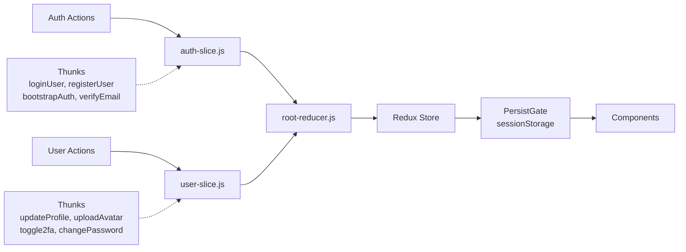

# Frontend Architecture Audit Report

**Target:** `d:\DEV CLOUD\PROJECTS\myProjects\LEARNING_APPS\NEW-STARTER\frontend\`  
**Mission:** Next.js 15 + Redux Toolkit architecture audit  
**Generated:** March 31, 2026

---

## 1. Route Group Hierarchy Diagram

```mermaid
graph TD
    A[src/app] --> B[(auth)/]
    A --> C[(protected)/]
    A --> D[(public)/]
    A --> E[layout.jsx]
    A --> F[loading.jsx]
    A --> G[error.jsx]
    
    B --> B1[login/]
    B --> B2[signup/]
    B --> B3[forgot-password/]
    B --> B4[reset-password/]
    B --> B5[verify-email/]
    B --> B6[layout.jsx]
    
    C --> C1[page.jsx]
    C --> C2[settings/]
    C --> C3[layout.jsx]
    
    D --> D1[privacy-policy/]
    D --> D2[terms-of-service/]
    D --> D3[layout.jsx]
```

**Route Groups Analysis:**
- **(auth)/**: 5 auth flows (login, signup, forgot-password, reset-password, verify-email) - Public-only routes with auth layout
- **(protected)/**: Dashboard (`/`) + settings - Requires `refresh_token` cookie
- **(public)/**: Legal pages (privacy-policy, terms-of-service) - No auth required

---

## 2. Redux State Flow Diagram



**State Management Analysis:**

| Slice | Purpose | Persisted | Fields |
|-------|---------|-----------|--------|
| **auth** | Authentication state | ✅ SessionStorage | `user`, `accessToken`, `isAuthenticated`, `isLoading`, `error`, `sessionExpired`, `isBootstrapComplete`, `isVerifying` |
| **user** | User profile data | ❌ Memory only | `profile`, `isLoading`, `error` |

**Store Configuration:** `d:\DEV CLOUD\PROJECTS\myProjects\LEARNING_APPS\NEW-STARTER\frontend\src\store\index.js:53-66`
- Uses `redux-persist` with sessionStorage for auth slice
- Only `isAuthenticated` is whitelisted for persistence (not tokens)
- DevTools enabled in non-production
- Serializability check ignores persist actions

---

## 3. Component Categorization Table

**Total Components in `features/auth/components/`: 64+ items**

| Category | Components | Purpose |
|----------|-----------|---------|
| **Forms** | `auth-error-alert.jsx`, `auth-form-provider.jsx`, `auth-submit-button.jsx`, `form-field.jsx`, `reset-password-form.jsx` | Form primitives and validation |
| **Login Flow** | `login-form.jsx`, `login-header.jsx`, `login-options.jsx`, `two-factor-step.jsx`, `welcome-section.jsx` | Login UI + 2FA step |
| **Forgot Password** | `back-to-login-link.jsx`, `forgot-password-header.jsx`, `form-header.jsx`, `form-state.jsx`, `help-text.jsx`, `success-actions.jsx`, `success-icon.jsx`, `success-message.jsx`, `success-state.jsx`, `troubleshooting-tips.jsx` | Password recovery flow |
| **Reset Password** | `back-to-login-link.jsx`, `form-header.jsx`, `form-state.jsx`, `help-text.jsx`, `password-field.jsx`, `password-strength.jsx`, `requirements-check.jsx`, `reset-form.jsx`, `success-message.jsx` | Password reset UI |
| **Verify Email** | `error-actions.jsx`, `error-icon.jsx`, `error-state.jsx`, `expired-message.jsx`, `loading-spinner.jsx`, `success-actions.jsx`, `success-icon.jsx`, `success-state.jsx`, `verification-ui.jsx` | Email verification states |
| **Guards** | `protected-guard.jsx`, `public-guard.jsx` | Route protection HOCs |
| **Providers** | `auth-providers.jsx` | Auth context providers |
| **Bootstrap** | `auth-bootstrap.jsx` | Session initialization |
| **Error Handling** | `dev-error-toggle.jsx`, `dev-wrapper.jsx`, `error-simulator.jsx`, `production-error-trigger.jsx` | Development error testing |
| **Skeletons** | 5 skeleton components | Loading states |

---

## 4. Security Header Compliance Report

**Source:** `d:\DEV CLOUD\PROJECTS\myProjects\LEARNING_APPS\NEW-STARTER\frontend\next.config.mjs:28-72`

| Header | Status | Value |
|--------|--------|-------|
| **X-Frame-Options** | ✅ Set | `DENY` |
| **X-Content-Type-Options** | ✅ Set | `nosniff` |
| **X-XSS-Protection** | ✅ Set | `1; mode=block` |
| **Referrer-Policy** | ✅ Set | `strict-origin-when-cross-origin` |
| **Permissions-Policy** | ✅ Set | `camera=(), microphone=(), geolocation=(), interest-cohort=()` |
| **Content-Security-Policy** | ⚠️ Review | See below |
| **poweredByHeader** | ✅ Disabled | `false` |

**CSP Configuration Analysis:**
```javascript
default-src 'self';
script-src 'self' 'unsafe-eval' 'unsafe-inline';  // ⚠️ unsafe-eval for Next.js
style-src 'self' 'unsafe-inline' https://fonts.googleapis.com;
font-src 'self' https://fonts.gstatic.com;
img-src 'self' data: https://*;
connect-src 'self' ${API_URL} ws://localhost:*;
media-src 'self';
object-src 'none';
frame-ancestors 'none';
base-uri 'self';
form-action 'self';
```

**CSP Notes:**
- `'unsafe-eval'` is required for Next.js but reduces XSS protection
- `'unsafe-inline'` on scripts allows inline handlers (mitigated by Next.js nonce system)
- Fonts loaded from Google Fonts CDN

**API Proxy Configuration:**
```javascript
rewrites: [{
  source: '/api/:path*',
  destination: `${apiUrl}/api/:path*`
}]
```
✅ All API calls use `/api/v1/` prefix proxied to backend

---

## 5. Constitution Violation Report

### ✅ COMPLIANT AREAS

| Rule | Status | Evidence |
|------|--------|----------|
| **Redux Toolkit for global state** | ✅ PASS | `store/slices/auth/auth-slice.js`, `store/slices/user/user-slice.js` |
| **No Context API for global state** | ✅ PASS | Only 3rd-party library context (`input-otp` OTPInputContext) |
| **Tailwind CSS only** | ✅ PASS | No styled-components, emotion, or CSS-in-JS found |
| **JWT in HttpOnly cookie** | ✅ PASS | `refresh_token` cookie checked in middleware |
| **API routes prefixed /api/v1/** | ✅ PASS | `auth-endpoints.js:10-11` |
| **No console.log in production** | ✅ PASS | Sanitized logging with env check in `private-client.js:147-148` |

### ⚠️ MINOR OBSERVATIONS

| Item | Location | Note |
|------|----------|------|
| Context API usage | `input-otp.jsx:41` | 3rd-party library (`input-otp`) using `OTPInputContext` - Acceptable for component-level state |
| console.log in dev | `private-client.js:148` | Guarded by `process.env.NODE_ENV === "development"` - Acceptable |

### 🎯 ARCHITECTURE STRENGTHS

1. **Proper Auth Flow**: Middleware checks `refresh_token` cookie → Protected routes redirect to login with `returnTo` param
2. **Token Management**: Access token stored in Redux memory only, refresh token in HttpOnly cookie
3. **API Client Architecture**: Clean separation between `public-client.js` and `private-client.js` with automatic token refresh
4. **i18n Implementation**: `next-intl` with cookie-based locale detection (`NEXT_LOCALE`)
5. **Route Guards**: `protected-guard.jsx` and `public-guard.jsx` for component-level protection
6. **Session Bootstrap**: `auth-bootstrap.jsx` restores session on app load via refresh token

---

## Summary

**Overall Status: ✅ ARCHITECTURE COMPLIANT**

The frontend architecture follows the project constitution:
- Redux Toolkit manages global state (no Context API violations for global state)
- Tailwind CSS is used exclusively (no CSS-in-JS libraries)
- Security headers are properly configured
- Authentication flow correctly uses HttpOnly cookies for refresh tokens
- API integration follows the `/api/v1/` prefix convention
- i18n is properly implemented with `next-intl`

**Component Count**: 64+ components in `features/auth/components/` organized by feature domain with clear separation of concerns.
