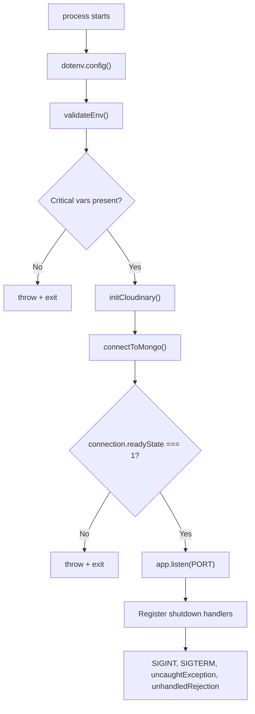
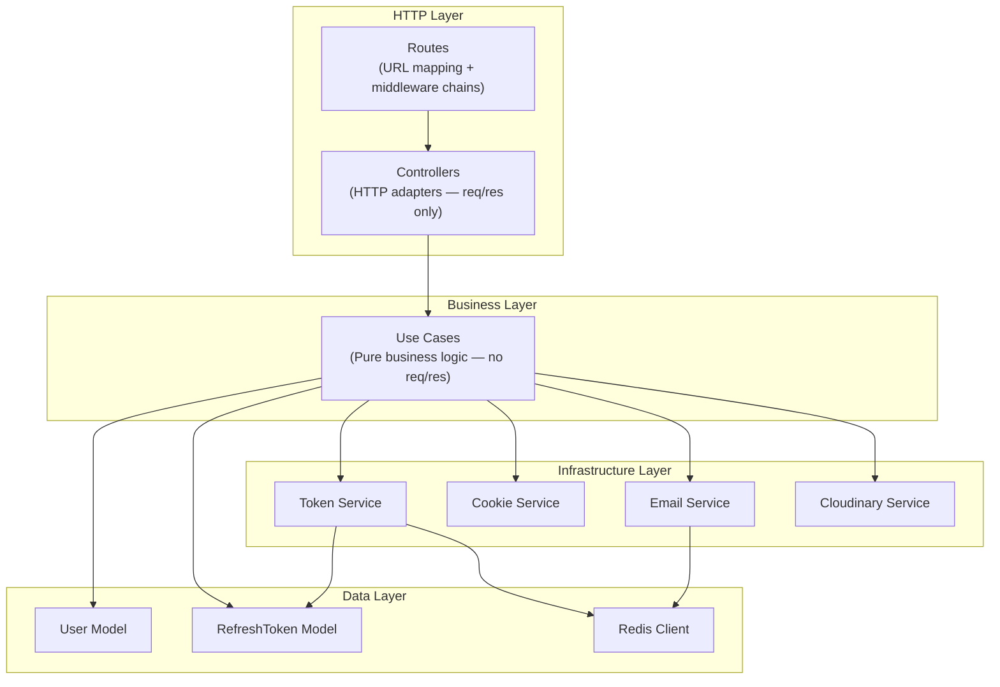

# Backend Architecture — New Starter Kit

## 1. Bootstrap Sequence

The backend separates app creation from server startup. `app.js` is a pure factory with zero side effects. `index.js` is the production entry point that orchestrates the boot sequence.



**Note:** `validateEnv()` splits variables into two tiers:
- **Critical** (`ACCESS_TOKEN_SECRET`, `REFRESH_TOKEN_SECRET`): throw and stop server
- **Recommended** (`ETHEREAL_HOST`, `CORS origins`): warn and continue

## 2. Express Middleware Pipeline

Every request passes through this exact middleware chain, registered in `app.js` in the order shown. The order is load-bearing — security must execute before parsing, parsing before routing.

The very first line after Express app creation is `app.set('trust proxy', 1)` — required for correct IP resolution behind reverse proxies (rate limiting, logging).

| Order | Middleware | File | Type | Purpose |
|-------|-----------|------|------|---------|
| 0 | trust proxy | app.js | config | IP resolution behind proxies |
| 1 | API Version | api-version-middleware.js | metadata | X-API-Version header + deprecation warnings |
| 2 | Helmet | helmet-middleware.js | security | CSP, HSTS, XSS-Filter, Frame-Options, Referrer-Policy |
| 3 | Global Rate Limiter | rate-limiter-middleware.js | security | Redis-backed request throttling |
| 4 | CORS Credentials | credentials-middleware.js | security | Origin whitelist, Access-Control headers |
| 5 | XSS Sanitize | sanitize-middleware.js | security | Recursive input sanitization (strict/relaxed/html modes) |
| 6 | Request ID | request-id-middleware.js | tracing | Unique ID per request for log correlation |
| 7 | Logging | logging-middleware.js | observability | Pino structured request/response logging |
| 8 | User Activity | logging-user-activity-middleware.js | audit | User action tracking (excludes /test-error, /assets) |
| 9 | Body Parser | body-parser-middleware.js | parsing | JSON + URL-encoded body parsing |
| 10 | Cookie Parser | (express) | parsing | Cookie parsing for refresh_token |
| 11 | Content Negotiation | content-type-negotiation-middleware.js | parsing | Content-Type validation + analytics |
| 12 | Static Files | express.static | serving | /assets directory |
| 13-16 | Route Handlers | routes/ | routing | Auth, Health, User, Test routes |
| 17 | Not Found | not-found-middleware.js | error | 404 catch-all |
| 18 | Error Handler | error-handler-middleware.js | error | Centralized error response formatting |


## 3. Layer Architecture

The backend follows a strict 4-layer architecture. Each layer has a single responsibility and may only call the layer directly below it.



| Layer | Directory | Responsibility | Input | Output |
|-------|-----------|---------------|-------|--------|
| Routes | routes/ | URL mapping, middleware chain assembly | — | Passes req to controller |
| Controllers | controllers/ | HTTP adapter — extracts data from req, calls use case, formats res | req, res | HTTP response via sendUseCaseResponse |
| Use Cases | use-cases/ | Pure business logic — validates rules, orchestrates services | DTO (plain object) | Result object { success, status, message, data, errorCode } |
| Services | services/ | Infrastructure integration — tokens, cookies, email, storage | Function params | Service-specific return values |
| Models | model/ | Data schema, persistence, indexes | Mongoose queries | Documents |
| Utilities | utilities/ | Stateless helper functions — hashing, crypto, formatting | Function params | Computed values |

## 4. Complete Route Map

All routes are versioned under `/api/v1`. Each route has its own rate limiter, input validation, and optional auth guard.

### 4.1 Authentication Routes (Public)

| Method | Path | Rate Limiter | Validation Rules | Controller | Use Case |
|--------|------|-------------|-----------------|------------|----------|
| POST | /api/v1/auth/login | loginLimiter | loginValidationRules | handleLogin | loginUseCase |
| POST | /api/v1/auth/register | registerLimiter | registerValidationRules | handleRegister | registerUseCase |
| POST | /api/v1/auth/verify-email | standardLimiter | emailVerificationValidationRules | handleVerifyEmail | verifyEmailUseCase |
| POST | /api/v1/auth/resend-verification | resendVerificationLimiter | resendVerificationValidationRules | handleResendVerification | resendVerificationUseCase |
| POST | /api/v1/auth/forgot-password | forgotPasswordLimiter | forgotPasswordValidationRules | handleForgotPassword | forgotPasswordUseCase |
| POST | /api/v1/auth/reset-password | standardLimiter | resetPasswordValidationRules | handleResetPassword | resetPasswordUseCase |
| POST | /api/v1/auth/refresh | refreshLimiter | — | handleRefreshToken | refreshTokenUseCase |
| POST | /api/v1/auth/verify-2fa | standardLimiter | verify2faValidationRules | handleVerify2fa | verify2faUseCase |
| POST | /api/v1/auth/resend-2fa | resend2faLimiter | — | handleResend2fa | resend2faUseCase |

### 4.2 Authentication Routes (Protected)

| Method | Path | Auth | Rate Limiter | Controller | Use Case |
|--------|------|------|-------------|------------|----------|
| POST | /api/v1/auth/logout | authTokenMiddleware | — | handleLogout | logoutUseCase |
| POST | /api/v1/auth/logout-all | authTokenMiddleware | — | handleLogoutAll | logoutAllUseCase |

### 4.3 User Routes (Protected)

| Method | Path | Auth | Validation | Controller | Use Case |
|--------|------|------|-----------|------------|----------|
| GET | /api/v1/user/me | authTokenMiddleware | — | getCurrentUser | Direct User.findById |
| PATCH | /api/v1/user/me | authTokenMiddleware | updateProfileValidationRules | updateProfile | updateProfileUseCase |
| POST | /api/v1/user/security/password | authTokenMiddleware | updatePasswordValidationRules | handleChangePassword | changePasswordUseCase |
| POST | /api/v1/user/email/request | authTokenMiddleware | emailChangeValidationRules | handleRequestEmailChange | requestEmailChangeUseCase |
| GET | /api/v1/user/email/confirm/:token | — | — | handleConfirmEmailChange | confirmEmailChangeUseCase |
| PATCH | /api/v1/user/security/2fa | authTokenMiddleware | toggle2faValidationRules | handleToggle2fa | toggle2faUseCase |
| POST | /api/v1/user/profile/avatar | authTokenMiddleware | multerMiddleware | handleUploadAvatar | uploadAvatarUseCase |

### 4.4 Infrastructure Routes

| Method | Path | Rate Limiter | Purpose |
|--------|------|-------------|---------|
| GET | /api/v1/health | healthLimiter | MongoDB + Redis connectivity check |

### 4.5 Development-Only Routes

These routes are only mounted when `NODE_ENV === 'development'`.

| Method | Path | Purpose |
|--------|------|---------|
| GET | /test/health | Detailed diagnostics |
| GET | /test/error | Error handling verification |
| GET | /test/security/helmet | Helmet header inspection |
| GET | /test/security/sanitize | XSS sanitization test |
| POST | /test/security/dangerous | Dangerous input test |
| GET | /test/security/stats | Security statistics |

## 5. Controller Pattern

Controllers are thin HTTP adapters. They extract data from the request, call a use case, and delegate response formatting to the `sendUseCaseResponse` wrapper.

```javascript
// Standard controller pattern
const handleLogin = async (req, res, next) => {
  try {
    const { email, password, rememberMe } = req.body;
    
    const result = await loginUseCase({
      email,
      password,
      rememberMe,
      userAgent: req.headers["user-agent"],
      ipAddress: req.ip,
    });

    // Cookie set here (only controllers touch res)
    if (result.success && result.data.refreshTokenValue) {
      setRefreshTokenCookie(res, result.data.refreshTokenValue, rememberMe);
    }

    sendUseCaseResponse(res, result);
  } catch (error) {
    next(error);
  }
};
```

`sendUseCaseResponse` maps the use-case result to the standard API response envelope defined by `apiResponseManager`.

## 6. Use Case Pattern

Use cases are pure business logic functions. They receive a plain DTO, return a result object, and never touch req/res.

```javascript
// Standard use case result shape
{
  success: true,       // or false
  status: 200,         // HTTP status code
  message: "Human-readable message",
  data: { ... },       // payload (optional)
  errorCode: "CODE"    // only on failure
}
```

## 7. Error System

All errors flow through a unified error class hierarchy rooted at `AppError`. The centralized error handler middleware catches everything and formats consistent responses.

| Error Class | Status | Default Code | Usage |
|-------------|--------|-------------|-------|
| AppError | 500 | INTERNAL_ERROR | Base class |
| ValidationError | 400 | VALIDATION_ERROR | Input validation failures |
| AuthError | 401 | AUTH_ERROR | Authentication failures |
| ForbiddenError | 403 | FORBIDDEN | Authorization failures |
| NotFoundError | 404 | NOT_FOUND | Resource not found |
| ConflictError | 409 | CONFLICT | Duplicate resources |
| RateLimitError | 429 | RATE_LIMITED | Rate limit exceeded |
| DatabaseError | 503 | DATABASE_ERROR | Database failures |

Every error response uses this envelope:

```json
{
  "success": false,
  "message": "Human-readable error message",
  "errorCode": "MACHINE_READABLE_CODE",
  "timestamp": "2024-01-01T00:00:00.000Z"
}
```

## 8. Validation Architecture

Input validation uses express-validator with strict patterns. All validation chains use `.bail()` after `.notEmpty()` and `.isString()` to fail fast. The project explicitly avoids `.escape()` — XSS prevention is handled at the sanitization middleware layer.

| Helper | Used By | Purpose |
|--------|---------|---------|
| passwordRules(field) | Register, Reset Password, Change Password | Min 8 chars, uppercase, lowercase, number, special char |
| emailRules({ checkDisposable }) | Register, Forgot Password, Login, Email Change | Valid format, lowercase, trimmed, optional disposable check |

**Notes:**
- Login does NOT validate password strength — only checks existence
- Forgot-password does NOT check for disposable emails
- Verify-email expects `{ token }` in req.body — not `code`, not `verificationCode`

## 9. Response Manager

All API responses are formatted by `apiResponseManager`, a centralized utility that ensures consistent envelope structure across every endpoint.

| Method | Usage | Produces |
|--------|-------|----------|
| sendSuccess(res, data, message, statusCode) | Happy path responses | { success: true, message, data } |
| sendError(res, message, statusCode, errorCode) | Error responses | { success: false, message, errorCode, timestamp } |
| sendValidationError(res, errors) | Validation failures | { success: false, message, errors, errorCode: "VALIDATION_ERROR" } |

## 10. Document Cross-References

| Topic | Document |
|-------|----------|
| System overview + tech stack | 01-SYSTEM-OVERVIEW.md |
| Frontend architecture | 03-FRONTEND-ARCHITECTURE.md |
| Authentication flows | 04-AUTH-SYSTEM.md |
| Database schemas | 05-DATABASE-DESIGN.md |
| Infrastructure services | 06-INFRASTRUCTURE.md |
