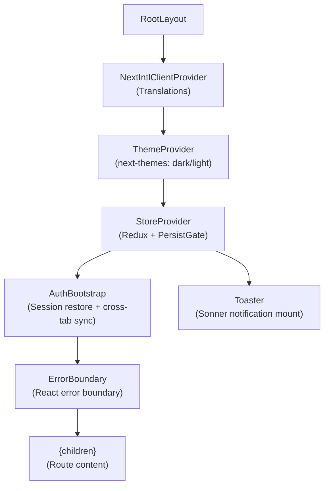
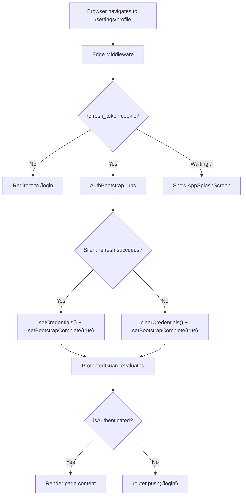
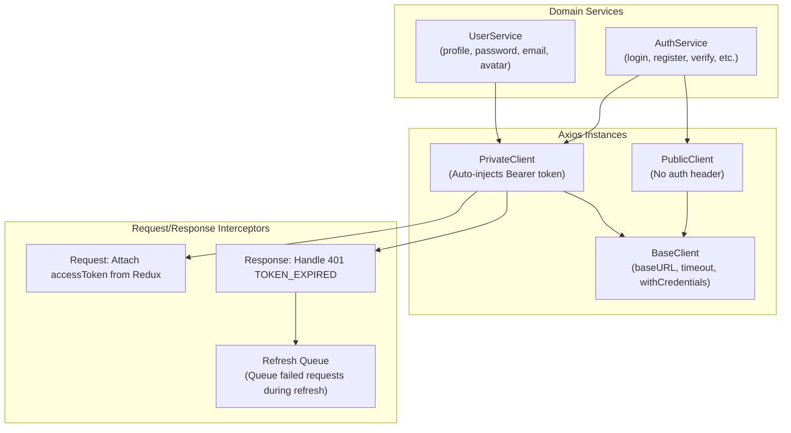

# Frontend Architecture — New Starter Kit

## 1. Architecture Philosophy

The frontend follows a Hook-Driven Feature Architecture. All business logic lives in custom hooks. Pages are thin connectors that import hooks and components, then wire them via props. Components are dumb — they receive everything via props, never import Redux, never make API calls, never navigate.

Three components are explicitly exempt from this rule: AuthBootstrap, ProtectedGuard, and PublicGuard. These are infrastructure components that are intentionally smart.

## 2. Directory Structure

```text
src/
├── app/                          # Next.js App Router pages (thin connectors)
│   ├── (auth)/                   # Public auth routes (PublicGuard)
│   │   ├── login/
│   │   ├── signup/
│   │   ├── forgot-password/
│   │   ├── reset-password/
│   │   ├── verify-email/
│   │   ├── layout.jsx           # Auth layout wrapper
│   │   └── error.jsx            # Auth error boundary
│   ├── (protected)/              # Private routes (ProtectedGuard)
│   │   ├── settings/
│   │   │   ├── profile/
│   │   │   ├── security/
│   │   │   ├── layout.jsx       # Settings layout (sidebar + mobile nav)
│   │   │   └── page.jsx         # Redirects to /settings/profile
│   ├── layout.jsx           # Protected layout (TopNav)
│   │   └── page.jsx             # Dashboard
│   ├── layout.jsx               # Root layout (providers)
│   ├── loading.jsx              # Route transition splash screen
│   ├── error.jsx                # Root error boundary
│   ├── global-error.jsx         # Unrecoverable error boundary
│   └── not-found.jsx            # 404 page
├── features/                     # Domain features
│   ├── auth/
│   │   ├── hooks/               # useLogin, useSignup, useForgotPassword, etc.
│   │   └── components/          # Login forms, signup forms, panels, guards
│   │       ├── guards/          # ProtectedGuard, PublicGuard
│   │       ├── forms/           # Reusable form components
│   │       ├── skeletons/       # Loading skeletons
│   │       └── ...
│   └── user/
│       ├── hooks/               # useUserProfile, useEditProfile, useChangePassword, etc.
│       ├── components/          # Profile content, security content, dashboard
│       │   └── skeletons/       # Loading skeletons
│       └── config/              # Feature configuration
├── components/
│   ├── ui/                      # shadcn/ui primitives (Button, Card, Input, etc.)
│   ├── layout/                  # TopNav, ThemeToggle
│   ├── shared/                  # AppSplashScreen, ErrorBoundary, ErrorFallback
│   └── providers/               # Context providers
├── store/                        # Redux store
│   ├── slices/                  # auth, user, ui, notifications
│   ├── index.js                 # Store configuration + persistor
│   ├── root-reducer.js          # Combined reducers
│   ├── root-actions.js          # Cross-slice actions
│   └── store-accessor.js       # Non-component dispatch (for interceptors)
├── services/
│   ├── api/
│   │   ├── client/              # BaseClient, PublicClient, PrivateClient
│   │   ├── endpoints/           # AuthEndpoints, UserEndpoints
│   │   └── refresh-queue.js     # Token refresh queue
│   ├── domain/                  # AuthService, UserService
│   └── storage/                 # CookieService, storage constants
├── hooks/                        # Global hooks (useTransitionReady, redux.js)
├── lib/                          # Utilities, config, notify, validations
├── i18n/                         # Internationalization config
└── middleware.js                 # Next.js Edge Middleware
```

## 3. Provider Hierarchy

The root layout establishes the provider chain. Order matters — Redux must be available before AuthBootstrap, and AuthBootstrap must run before any route guard evaluates.



## 4. Route Protection — Three Layers

Route protection uses three independent layers. Each layer catches different failure modes. All three must pass for a protected page to render.

| Layer | Where | Mechanism | What It Catches |
|-------|-------|-----------|----------------|
| 1. Edge Middleware | middleware.js (server) | Checks refresh_token cookie presence | Direct URL access without any session |
| 2. AuthBootstrap | Provider tree (client) | Silent refresh via raw fetch() | Stale cookies, expired sessions |
| 3. Route Guards | Layout components (client) | ProtectedGuard / PublicGuard check isBootstrapComplete + isAuthenticated | Post-bootstrap auth state |

**Critical**: Guards check `isBootstrapComplete`, NOT `isLoading`. `isLoading` changes during form submissions and would cause guards to unmount active forms. `isBootstrapComplete` is set exactly once after AuthBootstrap finishes and never changes again.



## 5. Redux State Architecture

State management uses Redux Toolkit with selective persistence. The access token is NEVER persisted — it lives in memory only (security requirement). User preferences persist to localStorage for UX continuity.

| Slice | Persistence | Storage | Key Fields |
|-------|-------------|---------|------------|
| auth | Partial | sessionStorage | isAuthenticated only (NOT accessToken) |
| user | Partial | localStorage | preferences only (theme, language, notifications) |
| ui | None | — | Layout, modal, loading, form states |
| notifications | None | — | Items array, unread count |

### Auth Slice — State Shape

| Field | Type | Initial | Purpose |
|-------|------|---------|---------|
| user | Object or null | null | Current user data |
| accessToken | String or null | null | JWT access token (memory only) |
| isAuthenticated | Boolean | false | Auth status flag |
| isLoading | Boolean | false | Auth operation in progress |
| error | String or null | null | Last auth error message |
| isVerifying | Boolean | false | Email verification in progress |
| sessionExpired | Boolean | false | Session timeout flag |
| isBootstrapComplete | Boolean | false | Set once after AuthBootstrap |

### Auth Slice — Key Actions

| Action | Type | Purpose |
|--------|------|---------|
| setCredentials | reducer | Set user + accessToken + isAuthenticated |
| clearCredentials | reducer | Clear all auth state |
| setBootstrapComplete | reducer | Mark bootstrap as done (once) |
| updateAccessToken | reducer | Token refresh (update token only) |
| setSessionExpired | reducer | Mark session as expired |
| loginUser | thunk | POST /auth/login |
| registerUser | thunk | POST /auth/register |
| verifyEmail | thunk | POST /auth/verify-email |
| forgotPassword | thunk | POST /auth/forgot-password |
| resetPassword | thunk | POST /auth/reset-password |
| verify2fa | thunk | POST /auth/verify-2fa |
| logoutAllDevices | thunk | POST /auth/logout-all |

## 6. API Client Architecture

The API layer uses three Axios instances with distinct responsibilities. The private client auto-injects the access token and handles silent token refresh on 401 responses.



### Refresh Queue Mechanism

When a 401 with errorCode TOKEN_EXPIRED is received, the interceptor queues the failed request and initiates a single refresh. All queued requests are retried with the new token once refresh succeeds.

| Property | Value | Purpose |
|----------|-------|---------|
| maxQueueSize | 50 | Prevent memory leaks |
| maxRetries | 3 | Limit retry attempts per request |
| isRefreshing | boolean | Prevent concurrent refresh calls |
| failedQueue | array | Queued requests awaiting new token |

## 7. Feature Hook Pattern

Every feature hook follows this contract: it reads from Redux, dispatches to Redux, calls API services, handles navigation, and returns everything the component needs via a flat object.

| Hook | Feature | Redux Reads | API Calls | Returns |
|------|---------|------------|-----------|---------|
| useLogin | auth | accessToken, isLoading, error | authService.login, authService.verify2fa | handleLogin, handleVerify2fa, requiresTwoFactor, isLoading, error |
| useSignup | auth | isLoading, error | authService.register | handleSignup, isLoading, error |
| useForgotPassword | auth | isLoading | authService.forgotPassword | handleSubmit, isLoading, isSubmitted |
| useResetPassword | auth | isLoading, error | authService.resetPassword | handleResetPassword, isLoading, error |
| useVerifyEmail | auth | isLoading, isVerifying | authService.verifyEmail, authService.resendVerification | handleResend, isLoading, verificationStatus |
| useUserProfile | user | user from auth slice | authService.logout | initials, displayName, email, avatar, handleLogout, avatarUrl |
| useEditProfile | user | user | userService.updateProfile | handleUpdateProfile, isLoading |
| useChangePassword | user | — | userService.changePassword | handleChangePassword, isLoading |
| useChangeEmail | user | — | userService.requestEmailChange | handleRequestChange, isLoading, isSubmitted |
| useToggle2fa | user | user | userService.toggle2fa | handleToggle, showPasswordField, isLoading |
| useProfilePhoto | user | user | userService.uploadAvatar | handleFileSelect, handleUpload, handleRemove, previewUrl, isUploading |
| useSignOutAll | user | — | authService.logoutAll | handleSignOutAll, isLoading |

## 8. Loading Infrastructure — Three Layers

The app uses a three-layer loading model to ensure smooth transitions with zero layout shift.

| Layer | Trigger | Component | Message |
|-------|---------|-----------|---------|
| Route Transition | Next.js navigation | loading.jsx → AppSplashScreen | "Heisen Core" branding + pulsing dots |
| Guard Resolution | isBootstrapComplete === false | Guard → AppSplashScreen | "Verifying your session..." or "Preparing..." |
| Page Mount | useTransitionReady hook | Feature skeleton component | Feature-specific skeleton UI |

Skeleton components live in `features/[feature]/components/skeletons/` and use the Skeleton primitive from `@/components/ui/skeleton`. Settings skeletons use bg-card wrapper for contrast on bg-muted backgrounds.

## 9. Notification System

Toast notifications use Sonner behind a static facade. Only two files in the entire project may import from 'sonner' directly: `src/lib/notify.js` and `src/components/ui/sonner.jsx`.

| Method | Default Duration | Usage |
|--------|-----------------|-------|
| NotificationService.success(msg, opts?) | 3500ms | Happy path confirmations |
| NotificationService.error(msg, opts?) | 6000ms | Error messages |
| NotificationService.warn(msg, opts?) | 5000ms | Warnings |
| NotificationService.info(msg, opts?) | 4000ms | Informational |
| NotificationService.loading(msg, opts?) | infinite | Long operations |
| NotificationService.promise(promise, msgs) | — | Async operations |
| NotificationService.dismiss(id?) | — | Programmatic dismiss |

### Toast ID Registry

| ID | Source | Prevents |
|----|--------|----------|
| session-expired | Interceptor (401 refresh failed) | Duplicate session expired toasts |
| global-403 | Interceptor (403) | Stacking forbidden toasts |
| global-429 | Interceptor (429) | Stacking rate limit toasts |
| global-500 | Interceptor (500) | Stacking server error toasts |
| global-5xx | Interceptor (502/503/504) | Stacking gateway error toasts |
| global-network | Interceptor (no response) | Stacking network error toasts |
| cross-tab-logout | BroadcastChannel LOGOUT | Duplicate logout toasts |

## 10. Document Cross-References

| Topic | Document |
|-------|----------|
| System overview | 01-SYSTEM-OVERVIEW.md |
| Backend architecture | 02-BACKEND-ARCHITECTURE.md |
| Authentication flows | 04-AUTH-SYSTEM.md |
| Database schemas | 05-DATABASE-DESIGN.md |
| Infrastructure services | 06-INFRASTRUCTURE.md |
