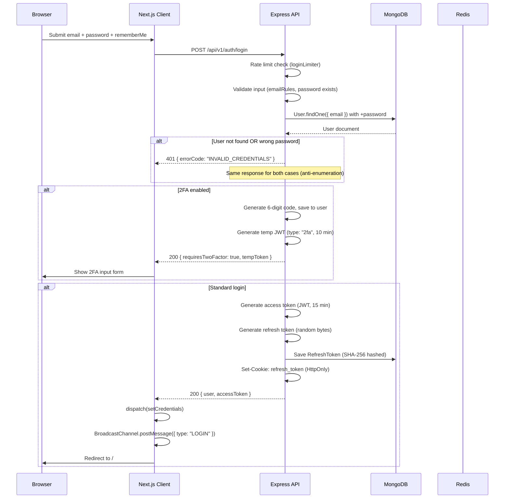
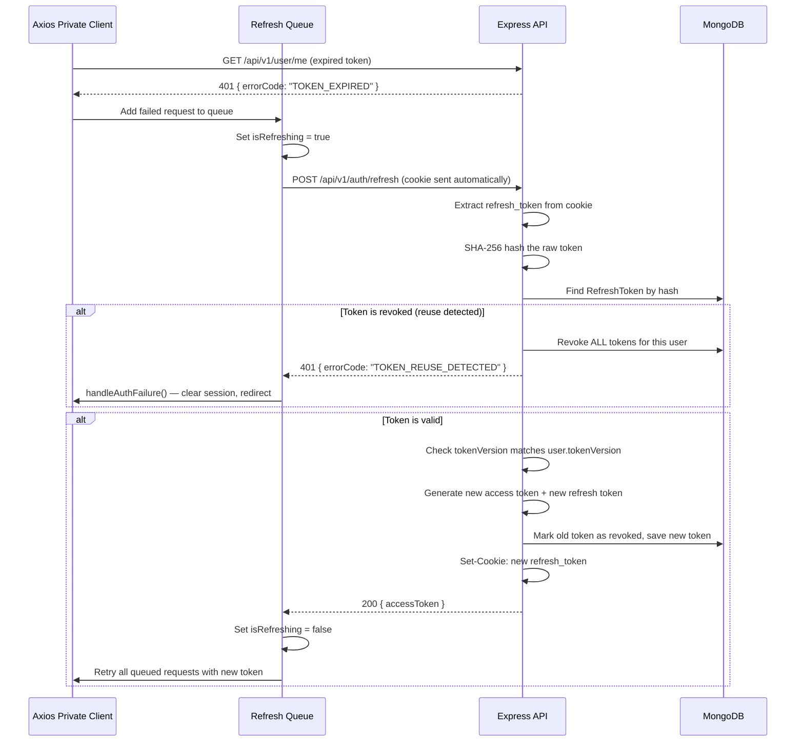
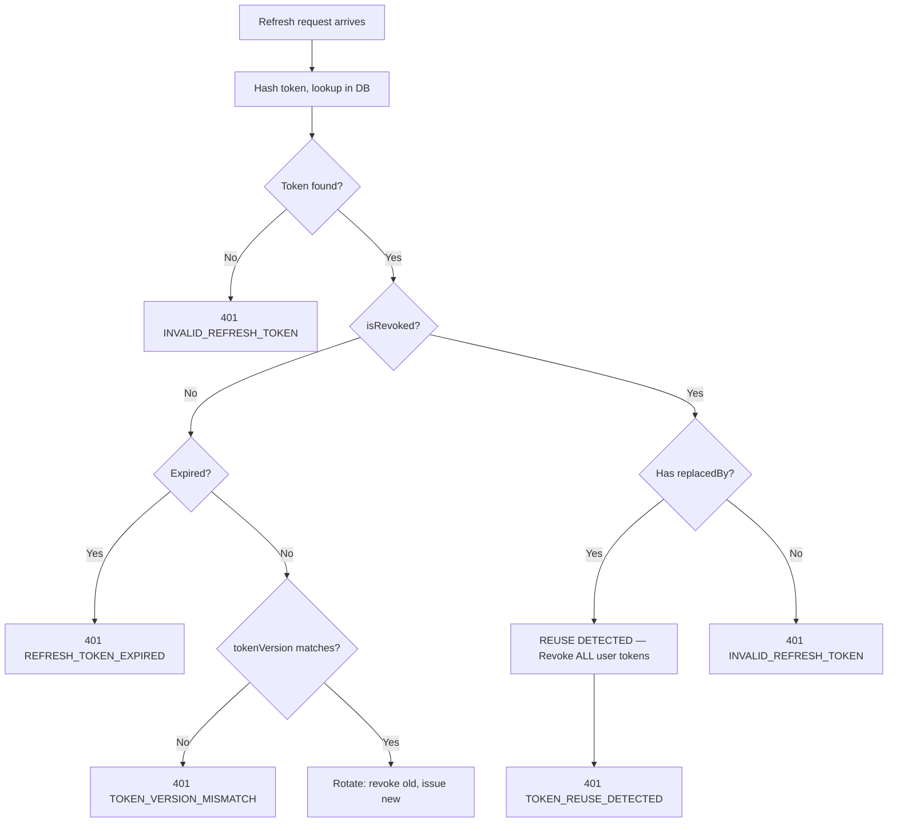
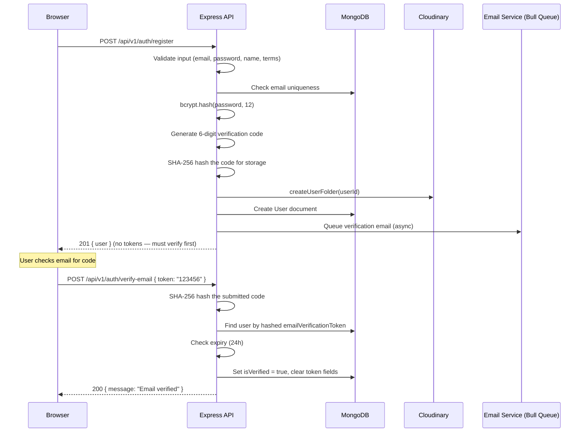
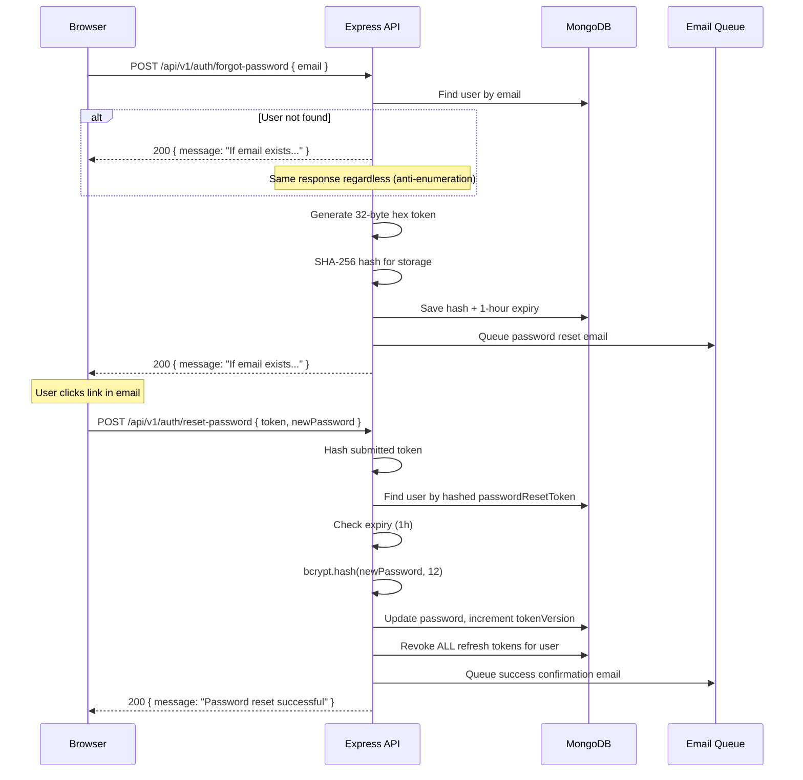
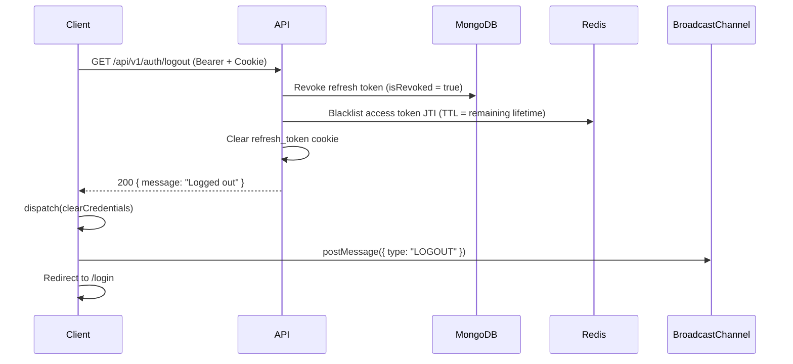

# Authentication System — New Starter Kit

## 1. Token Architecture

The application uses a dual-token architecture. The access token is short-lived and stored in Redux memory only — it is never persisted to localStorage, sessionStorage, or cookies on the client. The refresh token is long-lived and stored as an HTTP-only cookie — JavaScript cannot read it.

| Property | Access Token | Refresh Token |
|----------|-------------|---------------|
| Format | JWT (signed) | Random bytes (opaque) |
| Lifetime | 15 minutes | 7 days (default) or 30 days (rememberMe) |
| Storage (client) | Redux memory only | HTTP-only cookie |
| Storage (server) | Not stored | MongoDB (SHA-256 hashed) |
| Transport | Authorization: Bearer header | Cookie: refresh_token |
| Revocation | Redis blacklist (JTI) | MongoDB isRevoked flag |
| Secret | ACCESS_TOKEN_SECRET | REFRESH_TOKEN_SECRET |

The two JWT secrets MUST be different. Using the same secret for both tokens is a security vulnerability — a leaked refresh token could be used as an access token.

### JWT Claims Structure

```json
{
  "UserInfo": {
    "userId": "MongoDB ObjectId",
    "email": "user@example.com",
    "uuid": "crypto.randomUUID()",
    "type": "access"
  },
  "iss": "new-starter-backend-v1",
  "aud": "new-starter-web-client",
  "jti": "crypto.randomBytes(16).toString('hex')",
  "iat": 1704067200,
  "exp": 1704068100
}
```

## 2. Login Flow

Login supports three paths: standard login, 2FA-required login, and remember-me extended sessions.



## 3. Token Refresh Flow

When an API call receives a 401 with errorCode TOKEN_EXPIRED, the Axios interceptor automatically attempts a silent refresh. The refresh call uses a SEPARATE plain axios instance — not the interceptor-equipped one — to prevent infinite retry loops.



## 4. Token Reuse Detection

If a revoked refresh token is used, the system assumes token theft and performs nuclear revocation — ALL active sessions for that user are immediately revoked. This is implemented in the refresh token use case.



## 5. Registration + Email Verification Flow

Registration creates an unverified user and sends a 6-digit verification code via email. The code expires after 24 hours.



## 6. Password Reset Flow

Password reset uses a two-step flow: request a reset link, then submit the new password with the token. On successful reset, ALL active sessions are revoked (nuclear revocation).



## 7. Cookie Configuration

The refresh token cookie is configured for maximum security while supporting future OAuth and payment integrations.

| Property | Value | Rationale |
|----------|-------|-----------|
| Name | refresh_token | Convention (snake_case) |
| Path | / | Visible to all routes (required for middleware.js) |
| HttpOnly | always true | JavaScript cannot read the cookie |
| Secure | true (production), false (dev) | HTTPS only in production |
| SameSite | Lax | Allows top-level navigations (OAuth redirects) |
| MaxAge (rememberMe: true) | 30 days | Persistent cookie |
| MaxAge (rememberMe: false) | not set (session cookie) | Expires on browser close |

Note: When rememberMe is false, the cookie has no MaxAge (session cookie — disappears on browser close), but the database record has a 7-day TTL for orphan cleanup. These are intentionally different.

## 8. Logout Flow

Logout supports single-device and all-device variants.

### Single Device Logout



### All Devices Logout

Logout-all increments tokenVersion on the User document, which invalidates all existing access tokens (they carry the old version). It also revokes ALL refresh tokens in MongoDB.

## 9. Cross-Tab Session Sync

The BroadcastChannel API synchronizes auth state across browser tabs. Each tab's AuthBootstrap component listens for messages on the 'auth_channel' channel.

| Event | Broadcaster | Other Tabs Action | Same-Tab Prevention |
|-------|------------|-------------------|---------------------|
| LOGIN | useLogin hook | Full page reload to / | sessionStorage: login_source = "local" |
| LOGOUT | useUserProfile hook | clearCredentials + redirect to /login + toast | sessionStorage: logout_source = "local" |

Stale flags (logout_source, login_source) are cleared on every AuthBootstrap mount to prevent ghost state from previous sessions.

## 10. Security Properties

| Property | Implementation | Status |
|----------|---------------|--------|
| Access token in memory only | Redux store, never persisted | Enforced |
| Separate JWT secrets | ACCESS_TOKEN_SECRET ≠ REFRESH_TOKEN_SECRET | Enforced |
| Anti-enumeration (login) | Same error for wrong password + unknown email | Enforced |
| Anti-enumeration (forgot-password) | Same response regardless of email existence | Enforced |
| Token reuse detection | Revoked + has replacement = nuke all sessions | Implemented (needs test) |
| Password reset revokes sessions | All refresh tokens revoked on reset | Implemented (needs test) |
| AuthBootstrap uses raw fetch | Not interceptor axios (prevents circular dep) | Enforced |
| Refresh uses separate axios | Not interceptor instance (prevents infinite loop) | Enforced |

## 11. Document Cross-References

| Topic | Document |
|-------|----------|
| System overview | 01-SYSTEM-OVERVIEW.md |
| Backend architecture | 02-BACKEND-ARCHITECTURE.md |
| Frontend architecture | 03-FRONTEND-ARCHITECTURE.md |
| Database schemas | 05-DATABASE-DESIGN.md |
| Infrastructure services | 06-INFRASTRUCTURE.md |
