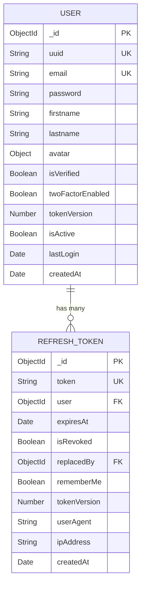
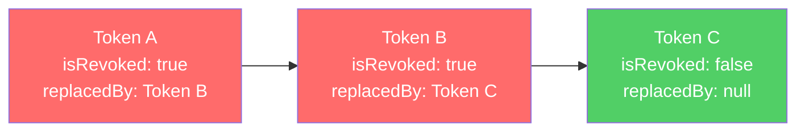

# Database Design — New Starter Kit

## 1. Overview

The application uses MongoDB as its primary database with Mongoose as the ODM. There are two collections: users and refreshtokens. The relationship is one-to-many — each user can have multiple active refresh tokens (one per device/session).

## 2. User Collection

### 2.1 Schema Fields

| Field | Type | Required | Default | Unique | Index | select | Notes |
|-------|------|----------|---------|--------|-------|--------|-------|
| uuid | String | Yes | crypto.randomUUID() | Yes | Yes | Yes | Public identifier |
| firstname | String | Yes | — | No | No | Yes | Min 3, max 16, auto-lowercase/trimmed |
| lastname | String | Yes | — | No | No | Yes | Min 3, max 16, auto-lowercase/trimmed |
| email | String | Yes | — | Yes | Yes | Yes | Auto-lowercase, trimmed |
| password | String | Yes | — | No | No | false | bcrypt hashed (12 rounds), min 8 max 128 |
| avatar | Object | No | null | No | No | Yes | { url: String, publicId: String } |
| isVerified | Boolean | Yes | false | No | No | Yes | Email verification status |
| verificationToken | String | No | — | No | No | false | SHA-256 hashed 6-digit code |
| verificationTokenExpiresAt | Date | No | — | No | No | false | 24-hour expiry |
| twoFactorEnabled | Boolean | Yes | false | No | No | Yes | 2FA toggle |
| twoFactorCode | String | No | — | No | No | false | 6-digit code |
| twoFactorExpiry | Date | No | — | No | No | false | 10-minute expiry |
| tokenVersion | Number | No | 1 | No | No | false | Incremented on security events |
| resetPasswordToken | String | No | — | No | No | false | SHA-256 hashed 32-byte hex |
| passwordResetExpiresAt | Date | No | — | No | No | false | 1-hour expiry |
| pendingEmail | String | No | — | No | No | false | New email awaiting confirmation |
| pendingEmailToken | String | No | — | No | No | false | SHA-256 hashed confirmation token |
| pendingEmailExpiresAt | Date | No | — | No | No | false | 24-hour expiry |
| lastLogin | Date | No | — | No | No | Yes | Updated on each login |
| lastSecurityEvent | Date | No | — | No | No | Yes | Updated on security changes |
| isActive | Boolean | Yes | true | No | No | Yes | Soft delete flag |
| createdAt | Date | Auto | — | No | Yes (desc) | Yes | Mongoose timestamp |
| updatedAt | Date | Auto | — | No | No | Yes | Mongoose timestamp |

### 2.2 Indexes

| Index | Fields | Type | Purpose |
|-------|--------|------|---------|
| uuid | { uuid: 1 } | Unique | Public-facing lookups |
| email | { email: 1 } | Unique | Login + uniqueness checks |
| createdAt | { createdAt: -1 } | Standard (descending) | Sorted user queries |

### 2.3 Pre-Save Hooks

The User schema has a pre-save hook that:
- Trims and lowercases firstname and lastname
- Lowercases email

### 2.4 Instance Methods

| Method | Returns | Purpose |
|--------|---------|---------|
| comparePassword(candidate) | Boolean (async) | bcrypt.compare against stored hash |
| updateLastLogin() | void | Sets lastLogin to now, saves |
| incrementTokenVersion() | void | tokenVersion++, saves (invalidates all tokens) |
| generateEmailVerificationToken() | String (6-digit code) | Generates code, hashes for storage, sets 24h expiry |
| generatePasswordReset() | String (32-byte hex) | Generates token, hashes for storage, sets 1h expiry |
| generateTwoFactorCode() | String (6-digit code) | Generates code, stores hashed, sets 10m expiry |

### 2.5 Virtual Fields

| Virtual | Computation |
|---------|------------|
| fullName | firstname + " " + lastname |

### 2.6 Fields with select: false

These fields are excluded from queries by default for security. They must be explicitly requested with .select('+field').

- password
- verificationToken
- verificationTokenExpiresAt
- twoFactorCode
- twoFactorExpiry
- tokenVersion
- resetPasswordToken
- passwordResetExpiresAt
- pendingEmail
- pendingEmailToken
- pendingEmailExpiresAt

## 3. RefreshToken Collection

### 3.1 Schema Fields

| Field | Type | Required | Default | Unique | Index | Notes |
|-------|------|----------|---------|--------|-------|-------|
| token | String | Yes | — | Yes | Yes | SHA-256 hash of raw refresh token |
| user | ObjectId (ref: User) | Yes | — | No | Yes | Foreign key to User |
| expiresAt | Date | Yes | — | No | TTL | MongoDB auto-deletes expired docs |
| isRevoked | Boolean | Yes | false | No | Compound | Soft revoke flag |
| replacedBy | ObjectId (self-ref) | No | — | No | No | Points to replacement token (rotation chain) |
| rememberMe | Boolean | Yes | false | No | No | Extended session flag |
| tokenVersion | Number | No | — | No | No | Snapshot of user.tokenVersion at creation |
| userAgent | String | No | — | No | No | Client user-agent string |
| ipAddress | String | No | — | No | No | Client IP address |
| createdAt | Date | Auto | — | No | No | Mongoose timestamp |
| updatedAt | Date | Auto | — | No | No | Mongoose timestamp |

### 3.2 Indexes

| Index | Fields | Type | Purpose |
|-------|--------|------|---------|
| token | { token: 1 } | Unique | Fast token lookup during refresh |
| user | { user: 1 } | Standard | Find all tokens for a user |
| expiresAt | { expiresAt: 1 } | TTL (expireAfterSeconds: 0) | Automatic cleanup of expired tokens |
| compound | { user: 1, isRevoked: 1, expiresAt: -1 } | Compound | Active session queries |

### 3.3 Token Rotation Chain

Every refresh creates a new token and marks the old one as revoked with a replacedBy pointer. This creates an auditable chain:

If Token A (revoked, has replacement) is used again, this is reuse detection — Token A was likely stolen. The system nukes ALL tokens for that user.

## 4. Token TTL Strategy

| Scenario | Cookie MaxAge | DB Token Expiry | Rationale |
|----------|-------------|----------------|-----------|
| rememberMe: true | 30 days | 30 days | Persistent session |
| rememberMe: false | Not set (session cookie) | 7 days | Cookie dies on browser close; DB record is orphan-cleaned after 7 days |
| After revocation | — | TTL still applies | MongoDB auto-deletes even revoked tokens after expiry |

## 5. Security Field Patterns

Sensitive tokens are never stored in plaintext. The application uses SHA-256 hashing for all stored tokens.

| Token Type | Generated As | Stored As | Compared By |
|------------|-------------|-----------|-------------|
| Refresh token | crypto.randomBytes | SHA-256 hash | Hash incoming, compare to stored hash |
| Email verification code | 6-digit numeric | SHA-256 hash | Hash incoming, query by hash |
| Password reset token | 32-byte hex | SHA-256 hash | Hash incoming, query by hash |
| 2FA code | 6-digit numeric | SHA-256 hash | Hash incoming, compare to stored hash |
| Password | Plain text (from user) | bcrypt hash (12 rounds) | bcrypt.compare |

## 6. Document Cross-References

| Topic | Document |
|-------|----------|
| System overview | 01-SYSTEM-OVERVIEW.md |
| Backend architecture | 02-BACKEND-ARCHITECTURE.md |
| Frontend architecture | 03-FRONTEND-ARCHITECTURE.md |
| Authentication flows | 04-AUTH-SYSTEM.md |
| Infrastructure services | 06-INFRASTRUCTURE.md |
