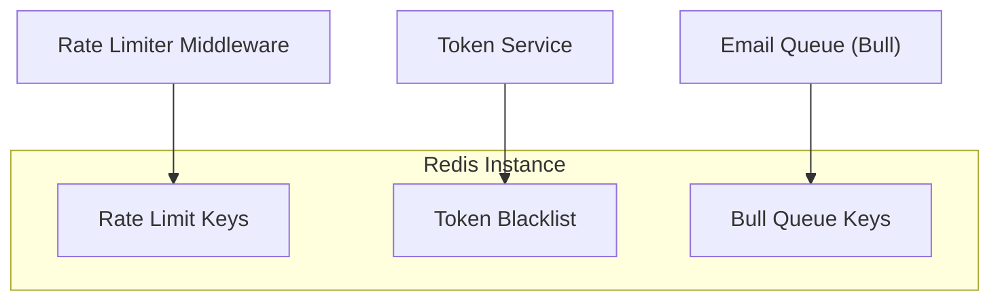
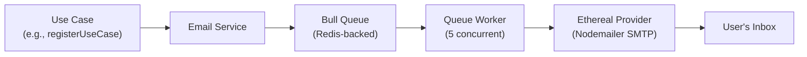

# Infrastructure Services — New Starter Kit

## 1. Redis

Redis serves three distinct roles in the application: rate limiting, token blacklisting, and job queue backing. It is a hard dependency — the server logs warnings if Redis is unavailable but rate limiting and email queues will fail.

| Feature | Key Pattern | TTL | Purpose |
|---------|------------|-----|---------|
| Rate Limiting | express-rate-limit keys | Per limiter window | Request throttling per IP |
| Token Blacklist | JTI string → "1" | Remaining token lifetime | Prevent reuse of revoked access tokens |
| Email Queue | Bull queue keys | Job-dependent | Async email processing |

### Redis Client Configuration

| Property | Value |
|----------|-------|
| Library | ioredis |
| Connection | process.env.REDIS_URL |
| Retry delay | 100ms |
| Max retries | 3 |
| Lazy connect | true (prevents startup crash if unavailable) |



## 2. Email System

Email delivery uses a queue-based architecture. Emails are not sent synchronously during API requests — they are pushed to a Bull queue backed by Redis and processed by worker threads.



### Email Service Methods

| Method | Template | Triggered By | Content |
|--------|----------|-------------|---------|
| sendVerificationEmail | auth/verification | Registration, Resend | 6-digit verification code |
| send2faCodeEmail | auth/2fa-code | Login (2FA), Resend 2FA | 6-digit 2FA code |
| sendWelcomeEmail | Ethereal SMTP | Email verification success | Welcome message |
| sendPasswordResetEmail | auth/password-reset | Forgot password | Reset link with token |
| sendResetSuccessEmail | auth/reset-success | Password reset success | Confirmation message |
| sendEmailChangeVerification | auth/email-change | Email change request | Confirmation link |

### Queue Configuration

| Property | Value |
|----------|-------|
| Library | Bull |
| Concurrency | 5 workers |
| Retry attempts | 3 |
| Retry strategy | Exponential backoff |
| Redis connection | Same instance as rate limiter |

### Email Provider

| Property | Value |
|----------|-------|
| Provider | Ethereal Email (sandbox) |
| Transport | Nodemailer SMTP |
| Host | process.env.ETHEREAL_HOST |
| Port | process.env.ETHEREAL_PORT |
| Auth | ETHEREAL_USER + ETHEREAL_PASS |
| From | process.env.EMAIL_FROM |

> View sent emails at https://ethereal.email/messages

## 3. Cloudinary (File Storage)

Cloudinary manages user avatar images. A dedicated folder structure is created for each user on registration.

### Folder Structure

```
users/
└── {userId}/
    ├── albums/
    ├── avatars/       (avatar uploads go here)
    ├── documents/
    └── temp/
```

### Service Methods

| Method | Purpose | Options |
|--------|---------|---------|
| createUserFolder(userId) | Create folder structure on registration | Creates 4 subfolders |
| deleteUserFolder(userId) | Delete all resources + folder | Recursive delete |
| uploadAvatar(userId, buffer, mimetype) | Upload to avatars subfolder | 400x400, face gravity, auto quality |
| deleteImage(publicId) | Destroy single image | By publicId |

Cloudinary is a soft dependency. If credentials are missing, validateEnv() warns but the server continues. Avatar features will fail gracefully.

## 4. Rate Limiting

Every route has a dedicated rate limiter in addition to the global limiter. Rate limiters use Redis as the backing store for distributed state. In test environments, all rate limiters are bypassed via the factory function.

| Limiter | Routes | Window | Max Requests | Notes |
|---------|--------|--------|-------------|-------|
| loginLimiter | /auth/login | 5 min | 10 | — |
| registerLimiter | /auth/register | 1 hour | 3 | — |
| forgotPasswordLimiter | /auth/forgot-password | 1 hour | 3 | — |
| resendVerificationLimiter | /auth/resend-verification | 1 hour | 3 | — |
| resend2faLimiter | /auth/resend-2fa | 1 min | 3 | — |
| refreshLimiter | /auth/refresh | 15 min | 10 | — |
| standardLimiter | /auth/verify-email, /auth/reset-password, /auth/verify-2fa | 15 min | 100 | Shared limiter |
| healthLimiter | /health | 1 min | 10 | — |
| testLimiter | /test/* | 1 min | 30 | Development only |
| apiLimiter | Global | 15 min | 100 | Skips admin users |

Rate limit responses include a Retry-After header. The frontend interceptor parses this header and includes the wait time in the toast notification.

### Rate Limit Response Format

```json
{
  "success": false,
  "message": "Too many requests, please try again later",
  "errorCode": "RATE_LIMITED",
  "timestamp": "2024-01-01T00:00:00.000Z"
}
```

> Note: Rate limiter values reflect actual runtime configuration.
> Override via environment variables: RATE_LIMIT_LOGIN_WINDOW_MS,
> RATE_LIMIT_LOGIN_MAX, etc.

## 5. Security Headers (Helmet)

Helmet configures HTTP security headers on every response.

| Header | Policy | Purpose |
|--------|--------|---------|
| Content-Security-Policy | Restrictive (self, inline for Next.js) | Prevent XSS, code injection |
| Strict-Transport-Security | max-age=31536000; includeSubDomains | Force HTTPS |
| X-Content-Type-Options | nosniff | Prevent MIME sniffing |
| X-Frame-Options | DENY | Prevent clickjacking |
| X-XSS-Protection | 0 (disabled per modern best practice) | Relies on CSP instead |
| Referrer-Policy | strict-origin-when-cross-origin | Control referrer information |
| Permissions-Policy | Restrictive | Disable unnecessary browser APIs |

## 6. XSS Sanitization

Input sanitization uses the xss library with three operation modes. The sanitize middleware recursively processes all string values in request bodies, query params, and URL params.

| Mode | Behavior | Usage |
|------|----------|-------|
| strict | Strip all HTML tags and attributes | Default for most inputs |
| relaxed | Allow safe subset of HTML | Rich text fields (if any) |
| html | Full HTML allowed | Admin content (restricted) |

Important: The project explicitly avoids .escape() in express-validator chains. XSS prevention is handled at the sanitization middleware layer, not the validation layer. This prevents double-encoding issues.

## 7. CORS Configuration

CORS is configured to allow specific origins only. The allowed origins list is loaded from environment variables.

| Property | Value |
|----------|-------|
| Allowed Origins | From ALLOWED_ORIGINS env var (comma-separated) |
| Credentials | true (required for cookies) |
| Methods | GET, POST, PUT, PATCH, DELETE, OPTIONS |
| Exposed Headers | X-API-Version, X-Request-ID |

## 8. Logging and Observability

The application uses structured logging with Pino for performance. Every request is assigned a unique request ID for distributed tracing.

| Component | Implementation | Purpose |
|-----------|---------------|---------|
| Logger | Pino (pino-pretty in dev) | Structured JSON logging |
| Request ID | request-id-middleware.js | Unique ID per request (UUID) |
| Request Logging | logging-middleware.js | Method, URL, status, duration |
| User Activity | logging-user-activity-middleware.js | Audit trail of user actions |
| Error Logging | emitLogMessage() facade | Consistent error context |

### Request ID Flow


## 9. Environment Configuration

Environment variables are validated on server startup via validateEnv(). Variables are classified as critical or recommended.

### Critical Variables (server will not start without these)

| Variable | Purpose |
|----------|---------|
| ACCESS_TOKEN_SECRET | JWT signing for access tokens |
| REFRESH_TOKEN_SECRET | JWT signing for refresh tokens |
| MONGODB_URI | Database connection string |

### Recommended Variables (server warns but continues)

| Variable | Purpose | Fallback |
|----------|---------|----------|
| ETHEREAL_HOST | Email SMTP host | Email features fail |
| ETHEREAL_PORT | Email SMTP port | Email features fail |
| ETHEREAL_USER | Email SMTP user | Email features fail |
| ETHEREAL_PASS | Email SMTP password | Email features fail |
| REDIS_URL | Redis connection | Rate limiting + queue fail |
| CLOUDINARY_CLOUD_NAME | Image CDN | Avatar features fail |
| CLOUDINARY_API_KEY | Image CDN auth | Avatar features fail |
| CLOUDINARY_API_SECRET | Image CDN auth | Avatar features fail |
| ALLOWED_ORIGINS | CORS whitelist | Defaults to localhost |

## 10. Testing Infrastructure

The testing setup separates unit and integration tests with different configurations and dependencies.

| Aspect | Unit Tests | Integration Tests |
|--------|-----------|-------------------|
| Command | npm run test:unit | npm run test:integration |
| Framework | Vitest | Vitest + supertest |
| Database | None | mongodb-memory-server |
| Coverage | 100% on auth utilities | Not measured separately |
| Mocking | Standard vi.mock() | vi.mock() + supertest agents |
| Rate Limiters | N/A | Bypassed via factory function |
| Email Service | N/A | Mocked (default export singleton) |
| Cloudinary | N/A | Mocked (vi.mock()) |
| Test Count | 86 | 39 |

Key testing rules:
- Never mock bcrypt, jsonwebtoken, or Node.js crypto
- vi.mock() is hoisted — never mock inside beforeEach
- Integration tests import app.js directly (no side effects, no app.listen)
- Integration tests wipe all collections in beforeEach
- Integration tests assert 3 layers: HTTP status + response body + database state

## 11. Document Cross-References

| Topic | Document |
|-------|----------|
| System overview | 01-SYSTEM-OVERVIEW.md |
| Backend architecture | 02-BACKEND-ARCHITECTURE.md |
| Frontend architecture | 03-FRONTEND-ARCHITECTURE.md |
| Authentication flows | 04-AUTH-SYSTEM.md |
| Database schemas | 05-DATABASE-DESIGN.md |
