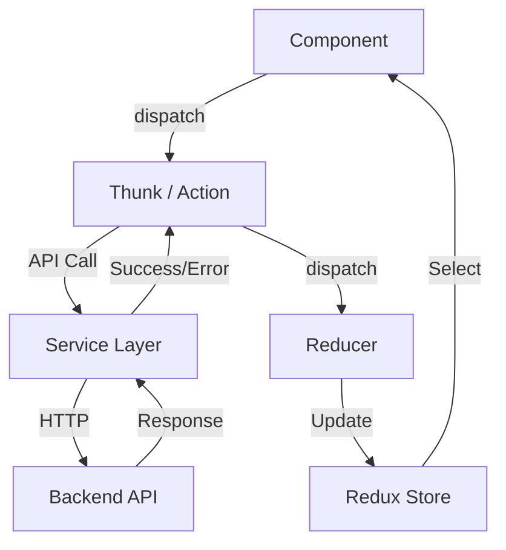

// frontend/docs/FLOW.md
# Frontend Architectural Flow Documentation

This document describes the core architectural patterns and data flows within the frontend application.

## 1. Directory Structure

```
services/
├── api/
│   ├── client/                    # HTTP Clients
│   │   ├── base-client.js         ← All common config
│   │   ├── public-client.js       ← No auth (login, register)
│   │   └── private-client.js      ← With auth + auto refresh
│   ├── endpoints/                 # URL Management
│   │   ├── auth-endpoints.js      ← Authentication, login, register, password reset
│   │   ├── user-endpoints.js      ← User profiles, preferences, sessions, security
│   │   └── admin-endpoints.js     ← Admin dashboard, user management, system settings
│   └── refresh-queue.js           ← Concurrent request management
├── domain/                        # Business Logic
│   ├── auth-service.js            ← Authentication operations
│   ├── user-service.js            ← User management
│   └── notification-service.js    ← Multi-channel notifications
└── storage/                       # Data Persistence
    ├── cookie-service.js          ← Secure cookie operations
    └── storage-constants.js       ← Configuration
```

## 2. Redux Data Flow

The application follows the standard unidirectional data flow pattern:



### 2.1 Store Initialization
`App` → `StoreProvider` → `Redux Store` → `PersistGate` → `Children Components`

---

## 3. Core Flows

### 3.1 Authentication Flow (Login)
1. **User Action**: Component dispatches `loginUser(credentials)`.
2. **Thunk**: `auth-thunks.js` handles the async logic.
3. **Service**: `auth-service.js` calls `login()`.
4. **API Client**: `public-client.js` sends `POST /auth/login`.
5. **Response**: Backend returns tokens and user data.
6. **State Update**: `auth-slice.js` updates the store; components re-render.

### 3.2 Secured API Request Flow
1. **Request**: Component dispatches a secured action (e.g., `fetchUserProfile`).
2. **Service**: `user-service.js` uses `privateClient`.
3. **Interceptor**: `auth-interceptor.js` automatically attaches the Bearer token.
4. **Error Handling**: `error-interceptor.js` catches `401` errors and triggers `refresh-queue.js`.
5. **Success**: `user-slice.js` updates the user data in the store.

### 3.3 Token Refresh Flow (RefreshQueue)
When a secured request fails with a `401`:
1. **Intercept**: `error-interceptor.js` calls `RefreshQueue.handleTokenRefresh()`.
2. **Queue**: Subsequent requests are queued while the single refresh call is in progress.
3. **Refresh**: `auth-service.js` calls `/auth/refresh` using the `refreshToken`.
4. **Resolution**:
    - **Success**: New tokens are stored in cookies/state, and all queued requests are retried.
    - **Failure**: User is logged out and redirected to `/login?session=expired`.

### 3.4 Notification Flow
1. **Trigger**: Any service or thunk calls `notificationService`.
2. **Process**: `notification-service.js` determines the channel (Toasts, in-app alerts).
3. **Redux**: Dispatches `showNotification` to `ui-slice.js`.
4. **UI**: The global Notification component renders the message.
